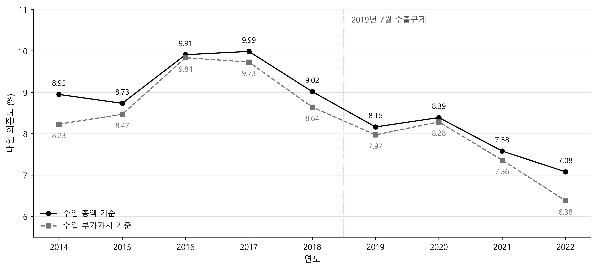
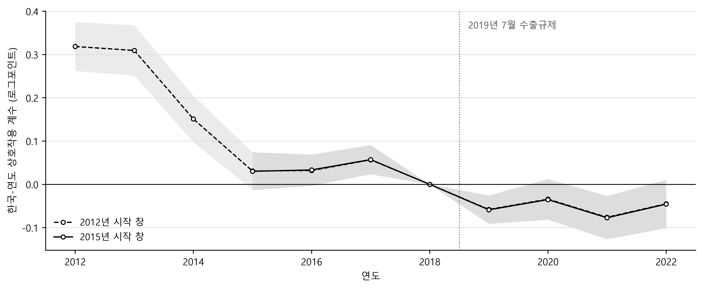

# 대일 의존은 실제로 낮아졌는가: 2019년 일본 수출규제 전후의 산업 수준 증거

작성: 2026-09-05

---

## 초록

2019년 7월 일본이 반도체·디스플레이 소재 3개 품목의 한국에 대한 수출을 개별허가로 전환한 이후 한국의 소재·부품·장비 대일 의존이 빠르게 낮아졌다는 평가가 제시되어 왔으나, 그 근거는 예외 없이 총액 기준 무역통계다. 총액 통계는 거래액 전체를 직전 수출국의 몫으로 기록하므로, 조달처를 일본에서 제3국으로 바꾸어도 그 제3국 제품이 일본산 중간재로 만들어진 것이라면 실질적 의존은 그대로인데 통계는 감소로 기록한다. 생산이 여러 나라에 걸쳐 있을 때 같은 부가가치가 단계마다 거듭 계상되는 문제도 여기서 비롯된다. 본 연구는 OECD 국가간산업연관표를 이용해 동일한 질문을 부가가치 기준에서 재검토한다. 부가가치 회계에서는 거래액을 그 안에 담긴 부가가치의 발생지별로 분해하므로, 경유 국가가 몇이든 일본에서 창출된 몫만이 일본에 귀속된다. 결과는 네 가지다. 첫째, 두 기준이 동일한 방향으로 이동했다. 한국 총수입 중 대일 비중은 2018년 9.02%에서 2022년 7.08%로 낮아졌고, 같은 수입에 체화된 외국 부가가치 가운데 일본 몫도 8.64%에서 6.38%로 더 큰 폭으로 낮아져 총액 감소가 경유지 변경에 따른 착시라는 해석은 지지되지 않는다. 둘째, 규제 품목이 실제로 투입되는 컴퓨터·전자·광학기기 산업에서 수출에 체화된 일본 부가가치의 비중을 보면 한국의 감소폭이 국제 비교에서 두드러지지 않는다. 이 비중의 2018년 대비 2022년 감소율은 한국 10.5%, 80개 경제 중위값 20.1%이나 종점을 2021년으로 설정하면 순서가 역전되며, 어느 종점에서도 한국은 분포의 중앙부에 위치한다. 셋째, 이 비중에 대해 한국이 동일 산업 타국의 공통 추세에서 이탈한 정도를 이중차분으로 추정하면 그 값이 추정 창에 따라 크게 달라지고 해당 산업만 분리하면 소멸한다. 이벤트 스터디는 그 원인이 2012년부터 진행된 사전 추세임을 보이며, 사전 추세를 감안하고 남는 2019년 이후의 이탈분은 크지 않다. 넷째, 대일 의존의 감소가 국내 생산으로 이어지지 않았다. 해당 산업 수출에 체화된 부가가치를 절대액으로 보면 일본분은 감소했으나 중국과 대만의 증가분이 그보다 훨씬 크고 한국 국내분은 오히려 줄었다. 다만 50산업 해상도와 연 단위 자료에서 규제 3개 품목은 분리되지 않으므로, 본 연구가 식별하는 것은 규제 품목의 인과효과가 아니라 그 사건을 계기로 한 산업 수준 조달구조의 변화다.

주제어: 글로벌 가치사슬, 부가가치 무역, 수출통제, 국가간산업연관표, 이중차분

---

## I. 서론

일본 경제산업성은 2019년 7월 4일 불화수소, 포토레지스트, 플루오린 폴리이미드 3개 품목의 한국에 대한 수출을 포괄허가에서 개별허가로 전환했고, 같은 해 8월 28일에는 한국을 수출관리 우대대상국에서 제외했다. 두 조치의 성격은 구별된다. 전자는 특정 품목의 통관을 실제로 지연시켰으나 후자는 전략물자 전반의 허가 절차를 변경했을 뿐 실질적 허가 지연을 수반하지 않았다. 규제는 2023년 3월부터 7월 사이에 단계적으로 해제되었다. 이 사건은 특정 품목에 대한 공급 차단이 상대국 산업 전반의 조달구조를 어느 정도로 재편시키는가라는 질문을 제기했고, 한국에서는 소재·부품·장비 산업의 대외의존 축소가 정책 목표로 설정되는 계기가 되었다.

이 사건에 대한 계량적 평가는 두 갈래로 이루어졌다. 하나는 품목별 무역통계를 이용한 국제 학술문헌이고, 다른 하나는 정부와 국책연구기관의 정책성과 집계다. 양자는 모두 총액 기준이다. 후자를 대표하는 수치는 산업통상자원부(2021)가 발표한 100대 핵심품목의 대일 의존도로, 규제 이후 31.4%에서 24.9%로 낮아졌다고 보고되었다. 이 지표는 HS 세번(tariff line)별 수입액을 분자와 분모로 삼은 기술통계다. 그런데 총액 기준 척도의 한계는 이 사건에서 특히 크게 작용한다. 규제 직후 허가 지연으로 통관이 지체되고 제3국 경유 수입이 증가했다는 정황이 보고되었기 때문이다. Makioka & Zhang (2024)은 동일 기간 일본의 대미 불화수소 수출이 94.6% 증가한 사실을 우회수출의 정황으로 해석했다. 결국 한국의 대일 수입 감소가 조달 전환이 아니라 경유지 변경이라면 총액 기준 지표는 발생하지 않은 자립을 보고하게 된다.

부가가치 기준 회계는 이 문제를 원리적으로 회피한다. Koopman, Wang & Wei (2014)가 정식화한 총수출의 부가가치 분해에서 거래액은 그 안에 담긴 부가가치의 발생지별로 나뉘고 각 국가에는 자국이 실제로 창출한 몫만 귀속된다. 가령 벨기에를 경유해 한국으로 유입된 일본산 소재는 벨기에로부터의 수입으로 계상되지만 그 내부의 일본 부가가치는 여전히 일본에 귀속된다. 중복 계상이 발생하지 않는 것도 같은 성질에서 나온다. 예를 들어, 일본이 소재를 한국에 100 수출하고 한국이 그것으로 만든 부품을 중국에 300 수출하며 중국이 완제품을 미국에 500 수출한다고 하자. 총액 기준의 세계 교역은 900이 되지만 실제로 창출된 부가가치는 500이고 일본의 100은 세 차례 계상되는데, 부가가치 기준에서는 각 단계에서 새로 창출된 몫만 더해진다. 따라서 총액 기준과 부가가치 기준을 병렬로 제시하면 두 가지 질문에 동시에 답할 수 있다. 대일 의존은 실제로 감소했는가, 그리고 총액 통계가 보고한 감소는 실질적 대체였는가 경유지 변경이었는가.

여기에 반사실(counterfactual)의 문제가 추가된다. 처치군(treatment group)이 단일 국가인 사건에서 감소의 크기를 판정하려면 비교 대상이 필요하다. 일본이 세계 전자 공급망에서 후퇴하는 것이 규제와 무관한 배경 추세라면 규제를 겪지 않은 국가들도 동일한 방향으로 이동했을 것이며, 동일한 정의로 측정된 타국의 동시 변화가 그 배경 추세를 측정하는 척도가 된다. 본 연구는 그 비교를 세 층위에서 수행한다. 한국과 세계 분포의 대조, 동일 산업 내 국가 간 이중차분(difference-in-differences), 그리고 연도별 이벤트 스터디다.

끝으로 일본이 비운 자리를 무엇이 채웠는지를 묻는다. 대일 의존의 감소가 국내 생산으로의 전환이었다면 수출에 체화된 자국 부가가치의 비중이 올라가야 하고, 조달처를 다른 나라로 옮긴 것이었다면 그 나라의 몫이 올라간다. 부가가치 회계는 같은 자료 안에서 두 경우를 갈라 준다.

---

## II. 선행연구와 본 연구의 위치

### 1. 선행연구

Makioka & Zhang (2024)은 품목×국가×월 단위 무역자료에 이중차분, 이벤트 스터디, 합성통제법(synthetic control method)을 적용해 규제의 교역효과를 추정했다. 불화수소의 한국에 대한 수출은 87.9% 감소했으나 포토레지스트와 플루오린 폴리이미드에서는 유의한 감소가 관측되지 않았다. 동일 기간 일본의 대미 불화수소 수출이 94.6% 증가해 우회수출의 정황을 보였고, 한국의 조달은 벨기에, 미국, 대만으로 재배치되었다. 반도체 장비 수입에는 부정적 파급효과(spillover)가, 대중국 장비 수출에는 급증이 관측된다. 기업 수준 증거는 재무제표 자료로 소수 기업의 추세를 제시하는 데 그쳤으며, 저자들은 표본이 작아 계량분석을 수반하지 않은 시사적 증거임을 명시했다.

Kim (2025)은 한국 사업체 수준 자료와 HS6 무역자료를 결합해 이중차분과 이벤트 스터디를 수행한 뒤 규모의 경제(economies of scale) 탄력성을 추정했다. 처치변수는 산업 수준의 노출도이며, 일본이 주 공급자였던 부문에 속하는지로 정의된다. 규제 발표만으로 한국의 대일 수입이 감소했고, 노출 부문에서는 국내 생산자의 매출 증가, 수출 확대, 가격 하락이 관측되었다고 보고한다. 분석의 초점은 국내 생산성과 규모탄력성에 있다. 같은 사건을 다룬 연구가 둘 더 있다. Shin & Balistreri (2022)는 연산가능(computable) 일반균형 모형으로 규제와 불매운동을 함께 넣어 후생효과를 한국 0.144%, 일본 0.013%의 손실로 추정했고, Haggard & Kim (2020)은 제조업체 설문에 근거한 서술이다. 사건은 다르지만 설계가 참고되는 인접 연구로 Kim & Cho (2024)가 있다. 미국이 2022년 중국에 부과한 반도체 수출통제가 제3국인 한국의 반도체 수출에 미친 효과를 품목 수준에서 분석한 것으로, 수출통제의 파급을 통제 대상국 밖에서 측정한다는 점이 본 연구와 겹친다.

한편 국내 문헌의 다수는 규제 자체가 아니라 규제에 대응한 정책을 평가한 연구다. 고영태·최상옥(2023)과 김민섭·이희상(2025)은 2019년 이후 확대된 소재·부품·장비 지원을 대상으로 기업 재무자료에 성향점수매칭과 이중차분을 결합해 정책효과를 추정했다. 두 연구의 처치변수는 정부 연구개발 수혜 또는 소재·부품·장비 전문기업 지정이고 결과변수는 성장성, 수익성, 안정성, 연구개발집약도이며, 조달국 전환이나 수입단가 같은 공급망 변수는 사용하지 않는다. 이들이 식별하는 것은 규제의 효과가 아니라 규제 이후 도입된 정책의 효과다. 국책연구기관의 소재·부품·장비 정책 평가 역시 정책 수혜를 처치변수로 삼는다.

### 2. 본 연구의 위치

국가간산업연관표로 한국의 대일 의존을 측정하는 작업 자체는 새롭지 않다. OECD가 세계무역기구와 함께 부가가치 무역 통계를 처음 공표한 2013년 이후 그 지표로 한국의 국제 분업 위치를 서술한 문헌은 국내에도 다수 존재한다. 그러나 이들은 수준과 추이의 서술에 머물며, 2019년 일본의 수출규제를 기준으로 전후를 구분하고 동일한 정의로 측정된 타국의 동시 변화를 반사실로 삼아 한국의 이탈분을 추정한 분석은 확인되지 않는다. 총액 기준으로 알려진 감소가 부가가치 기준에서도 성립하는지를 명시적으로 검정한 연구 또한 마찬가지다. 본 연구가 채우려는 위치가 그것이다. 다만 문헌 조사는 웹 검색에 기반했으며 비색인 문헌과 심사 중인 논문은 확인하지 못했으므로, 확인하지 못했다는 것이 부재의 확증은 아니다.

본 연구와 가장 근접한 두 국제 연구는 같은 질문을 두고 경쟁하지 않는다. 세 연구는 관측단위가 모두 다르고, 교역을 총액으로 재는지 부가가치로 재는지에서는 본 연구가 앞의 둘과 갈린다. 이 두 차이가 각 연구가 답할 수 있는 질문의 범위를 가른다. Makioka & Zhang (2024)은 품목×국가×월을 관측단위로 삼아 규제 시행 이후 일본이 한국에 수출한 규제 품목을 처치로, 비규제 품목과 다른 국가를 통제군으로 삼아 총액 기준의 무역액과 조달국 구성을 결과변수로 본다. 이 설계가 답하는 것은 규제 품목의 교역이 감소했는가다. Kim (2025)은 사업체를 관측단위로 삼아 규제 이후 노출 부문에 속하는지를 처치로, 비노출 산업을 통제군으로 삼아 한국의 매출, 수출, 가격, 생산성을 본다. 답하는 것은 노출 부문 생산자가 어떻게 변화했는가다. 이에 반해 본 연구는 국가×산업×연도를 관측단위로 삼아 2019년 이후의 한국을 처치로, 동일 산업 타국을 통제군으로 삼아 부가가치 기준의 대일 의존 비중을 본다. 답하는 것은 경제 전체의 의존이 실제로 감소했는가다.

---

## III. 분석의 틀과 자료

### 1. 산업 수준 부가가치 회계의 역할과 한계

기업 수준 미시자료가 가용하다면 언제나 그 쪽이 우월하다는 통념이 있으나 이 사건에서는 성립하지 않는다. 산업 수준 증거는 기업 수준 증거의 열등한 대용물이 아니라 상이한 질문에 답하는 도구이며, 그 근거는 세 가지다. 첫째, 검증 대상이 집계 명제라는 점이다. 정책 당국이 제시한 주장은 100대 핵심품목의 대일 의존도가 6.5%p 감소했다는 것으로, 이는 개별 기업이 아니라 경제 전체에 관한 명제다. 기업 수준 인과추정은 노출 기업이 비노출 기업 대비 얼마나 상이하게 반응했는지를 식별하지만 경제 전체의 의존이 실제로 감소했는지는 식별하지 못한다. 상대효과와 총량효과는 서로 다른 양이며, 노출 기업이 조달을 크게 변경하더라도 그 기업들의 경제 내 비중이 작으면 총량은 이동하지 않고, 역으로 총량이 이동하더라도 그것이 산업 구성의 변화에서 기인할 수 있다.

둘째, 부가가치 회계는 기업 자료로 구성할 수 없다. 실질적 대체와 경유지 변경을 구분하려면 수입품에 체화된(embodied) 부가가치의 국가별 구성을 알아야 하는데, 기업의 수입 신고자료에는 신고국과 원산지까지만 기록되고 그 원산지 국가가 다시 어디에서 무엇을 조달했는지는 세계 전체의 투입산출 구조를 풀어야 도출된다. 이 질문에 대해 국가간산업연관표는 차선책이 아니라 유일한 수단이다. 셋째, 국제 비교 반사실을 구성할 수 있다. 처치군이 단일 국가인 사건에서 감소의 크기를 판정하려면 규제를 겪지 않은 경제들의 동시 변화가 필요한데, 기업 자료는 국가마다 정의와 접근 조건이 상이해 이러한 비교가 사실상 불가능하다. 국가간산업연관표는 80개 경제를 동일한 정의와 동일한 균형 제약 아래 담고 있어, 반사실을 구성할 통제군이 자료 구조 자체에 들어 있다.

한계는 네 가지이며, 결과 해석에 앞서 명시한다. 해상도의 한계가 가장 크다. 국가간산업연관표는 50개 산업으로 구성되고, 규제 3개 품목은 화학(C20)에 함께 묶인다. 2018년 일본이 한국에 판 C20 제품이 69억 달러인데, 그중 HS 세번으로 분리되는 규제 품목 곧 불화수소와 포토레지스트의 수입액은 3.7억 달러로 5.4%다(관세청 2026). 규제 이후 실제로 급감한 것은 불화수소 하나이며, 그 수입액은 앞의 69억 달러 가운데 1%에도 못 미친다. 따라서 규제 품목의 변화는 산업 집계 안에서 다른 요인에 묻힌다. 시간 해상도 역시 제약이다. 자료가 연 단위이므로 2019년은 7월 이전 6개월이 처치 전에 해당하는 부분처치 연도이며, 발표효과와 시행효과를 구분할 수 없고 재고 조정과 같은 반년 단위 반응은 원리적으로 관측되지 않는다. 집계는 기업 간 분산을 소거하므로, 산업 평균이 움직이지 않았다고 해서 모든 기업이 움직이지 않은 것은 아니다. 마지막으로 처치군이 단일 국가여서 추론의 힘이 약하다. 국가 수준에서 군집화한 표준오차는 78개 경제를 군집으로 삼아 계산되지만 그중 처치를 받은 군집은 한국 하나이고 나머지 77곳이 통제군이다. 한국이 제공하는 19개 산업 계열은 같은 시점에 같은 처치를 받으므로 서로 독립된 관측으로 볼 수 없다. 사전 추세를 타국 평균으로만 검증할 수 있다는 제약도 여기에서 발생한다.

### 2. 자료의 선택

앞 절의 논의는 자료의 요구 조건을 세 가지로 좁힌다. 부가가치 분해가 가능한 세계 투입산출 구조여야 하고, 2019년 이후를 충분히 포괄해야 하며, 비교 가능한 다수 경제를 담아야 한다. 후보 자료를 차례로 검토하면 탈락 지점이 분명해진다. 관세청과 UN Comtrade의 총액 무역통계는 HS 세번 해상도가 가장 높고 월 단위까지 제공되지만 부가가치 분해가 불가능하다. 게다가 본 연구가 검증 대상으로 삼은 총액 기준 대일 의존도가 바로 이 자료에서 산출되므로, 같은 자료로는 그 지표를 검증할 수 없다. 한국은행 산업연관표는 한국 경제의 구조를 가장 정밀하게 담지만 국내표이므로 수입에 체화된 제3국 부가가치가 분해되지 않고 타국의 동일 지표가 없어 반사실을 구성할 수 없다. Timmer et al. (2015)의 세계투입산출표는 학계에서 가장 널리 사용되었으나 2014년에서 종료되어 사후 기간이 존재하지 않는다. Lenzen et al. (2013)의 Eora는 대상 경제가 넓은 대신 국가별 산업 분류가 상이하고 추정으로 보완한 비중이 커서 국가 간 비교에 부적합하며, 아시아개발은행 다지역산업연관표는 최근 연도까지 제공되지만 산업 구분이 더 굵고 대상 경제가 좁다. OECD (2025a)가 공표하는 부가가치 무역 통계는 본 연구가 사용하는 지표와 동일한 계보이고 최신 연도까지 제공된다. 본 연구가 쓰는 척도의 대부분은 이 공표 지표로도 구성할 수 있다. 다만 두 가지가 걸린다. 공표 지표는 중국과 멕시코를 가공무역 부문과 그 밖으로 나눈 확장판을 기준으로 산출되므로 두 버전을 견주는 강건성 점검이 불가능하고, 일본 부가가치가 어느 경로로 도달하는지를 가르려면 중간재 거래 행렬 자체가 있어야 한다. 두 가지 모두 원표를 요구하므로, 본 연구는 공표 지표와 자체 산출을 섞지 않고 모든 척도를 원표 하나에서 산출했다.

이상의 검토에서 남는 것이 OECD (2025b)의 국가간산업연관표 2025년판이다. 1995년부터 2022년까지 28개 연도, 80개 경제와 잔차지역, 50개 산업의 원표를 제공하므로 세 조건을 동시에 충족한다. 잔차지역은 개별 국가로 등재되지 않은 나머지 세계를 하나로 묶은 것이다. 사후 관측이 4개 연도에 불과한 것은 자료의 결함이 아니라 사건이 최근이라는 사실의 반영이며 다른 공개 자료도 이를 넘어서지 못한다. 이 자료는 두 가지 버전으로 배포되는데, 표준판은 81개 개체로 구성되고 확장판은 중국과 멕시코를 가공무역과 비가공무역으로 분할해 85개 개체로 구성된다. OECD의 공표 지표가 확장판에서 산출되므로 중국과 멕시코의 부가가치 비중은 표준판에서 공표치와 괴리가 발생하며, 한국 전자 공급망에서 중국이 차지하는 비중을 고려하면 확장판이 적절한 선택이라고 판단했다. 이에 따라 본 연구의 주 결과는 확장판에서 산출했고 표준판 결과를 표 4에 함께 제시했다. 확장판에서 개체를 집계하는 단위는 경제권이다. 중국이 두 개체로 나뉘어 있으므로 부가가치와 수출을 셀 때 둘을 합쳐 하나의 중국으로 다룬다.

원표에서 지표를 직접 산출했으므로 산출의 정확성을 별도로 검토했다. 산출한 지표를 OECD가 공표한 부가가치 무역 통계와 대조한 결과, 공표치가 10억 달러를 넘는 59,219개 칸에서 상대오차의 최댓값이 0.0%였다. 그보다 작은 칸을 판정에서 제외한 것은 분모가 작으면 상대오차가 과장되기 때문이다. 부가가치 계수의 정의도 이 대조에서 확정되었다. 계수는 총산출 대비 부가가치와 순생산물세, 곧 생산물에 부과된 세금에서 보조금을 뺀 값의 합으로 두어야 한다. 부가가치만으로 구성하면 국내 부가가치와 외국 부가가치의 합이 총수출에 미치지 못해, 수출의 일부가 어느 나라에도 귀속되지 않고 남는다.

### 3. 대일 의존도의 측정

대일 의존을 세 가지 척도로 측정한다. 앞의 둘은 한국의 수입을 대상으로 삼는 짝으로 모집단과 가중치가 같고 거래액을 그대로 세는지 그 안의 부가가치로 세는지에서만 갈린다. 셋째는 대상을 수출로 옮긴 계열이다. 앞의 둘은 IV.1절의 대조에, 셋째는 IV.2절 이후의 분석에 쓴다.

$$
\text{수입 총액 기준} = \frac{\text{한국의 대일 수입액}}{\text{한국의 총수입액}}
$$

$$
\text{수입 부가가치 기준} = \frac{\text{한국 수입에 체화된 일본 부가가치}}{\text{한국 수입에 체화된 외국 부가가치 총액}}
$$

$$
\text{수출 부가가치 기준} = \frac{\text{한국 수출에 체화된 일본 부가가치}}{\text{한국 총수출액}}
$$

수입 총액 기준은 정책 당국이 사용하는 것과 동일한 형태이며 분자와 분모 모두 중간재 거래와 최종재 거래의 합으로 구성한다. 다만 본 연구는 이 값을 무역통계가 아니라 나머지 두 척도와 동일한 국가간산업연관표에서 산출하므로, 서론에서 인용한 100대 핵심품목 기준의 수치와는 대상과 자료가 모두 다르다. 수입 부가가치 기준은 그 수입액을 안에 담긴 부가가치의 발생지별로 분해한 것이고, 수출 부가가치 기준은 같은 계수를 수입액이 아니라 총수출에 적용한 것이다.

세 척도를 기호로 옮기면 다음과 같다. 한국이 국가 $s$의 산업 $i$에서 들여온 금액을 $M_{si}$, 한국 산업 $i$의 총수출을 $E_i$라 하고, 어느 칸의 산출 한 단위에 담긴 경제권 $p$의 부가가치를 $\alpha^{p}_{si} = \sum_{k \in p} v_k B_{k,si}$로 둔다. $v$는 부가가치 계수, $B$는 레온티에프 역행렬이며 $k$는 경제권 $p$에 속한 산업을 훑는다.

$$
\text{수입 총액 기준} = \frac{\sum_i M_{\text{JPN}, i}}{\sum_{s,i} M_{si}}
$$

$$
\text{수입 부가가치 기준} = \frac{\sum_{s,i} M_{si} \alpha^{\text{JPN}}_{si}}{\sum_{s,i} M_{si}\left(1 - \alpha^{\text{KOR}}_{si}\right)}
$$

$$
\text{수출 부가가치 기준} = \frac{\sum_i \alpha^{\text{JPN}}_{\text{KOR}, i} E_i}{\sum_i E_i}
$$

$\sum_p \alpha^{p}_{si} = 1$이므로 수입에 담긴 부가가치를 발생 경제권별로 모두 더하면 총수입액과 같아진다. 둘째 식의 분모는 그 합에서 한국 자신의 몫을 뺀 것이며, 셋째 식의 분모가 총수출인 것과 구별된다. 세 척도 모두 새로 고안한 것이 아니다. 둘째 식의 분자와 분모는 OECD (2025a)가 `IMGR_BSCI`로 공표하는 수입의 발생지별 부가가치 분해에서 나오고, 셋째 식은 같은 체계의 수출 쪽 대응물인 `EXGR_BSCI`에서 나온다. 본 연구는 이를 공표 지표로 받지 않고 원표에서 직접 산출했으며, 그 산출이 공표치와 일치함은 III.2절에서 확인한 대로다.

앞의 두 척도는 IV.1절에서 짝으로 쓴다. 대상이 한국의 총수입으로 같고 가중치도 같으므로 두 값의 차이는 거래액을 그대로 세는지 그 안의 부가가치로 세는지에서만 온다. 총액 통계가 보고한 대일 의존 감소가 실질적 대체였는지 경유지 변경이었는지는 이 대조로 갈린다. 만약 부가가치 기준을 수출에서 정의하면 모집단이 한국의 총수입에서 그 가운데 다시 수출에 실려 나가는 부분으로 좁아지고 수출 구성으로 가중되므로, 두 척도의 차이에 총액과 부가가치 외의 요인이 섞인다.

수입에서 대일 의존을 재던 것을 수출로 옮기는 이유를 밝혀 둔다. 앞의 두 척도는 한국이 밖에서 사들인 것 전체를 대상으로 삼는다. 제3국을 거쳐 들어온 일본 부가가치까지 잡아내는 것이 그 척도의 요지이므로 집계 수준에서는 빠지는 몫이 없다. 그러나 이것을 산업별로 쪼개면 사정이 달라진다. 한 산업이 스스로 들여온 것에 담긴 일본 부가가치는 잡히지만, 그 산업이 국내 다른 산업에서 사들인 것에 담긴 일본 부가가치는 잡히지 않기 때문이다. 국내 화학산업이 일본산 원료로 만든 제품을 국내의 전자산업이 사서 쓰면 그 몫은 전자산업의 수입 어디에도 나타나지 않는다. 이 경로가 작지 않다. 2018년 한국 컴퓨터·전자·광학기기(C26)의 산출에 담긴 일본 부가가치 100.8억 달러를 도달 경로별로 가르면 일본에서 직접 들여온 중간재가 50.4억 달러, 제3국을 거쳐 들여온 중간재가 12.6억 달러, 국내에서 사들인 것이 37.8억 달러다. 수입만으로 재면 마지막 37.5%가 통째로 빠진다.

따라서 산업 수준에서는 질문을 바꾸어야 한다. 이 산업이 무엇을 사 왔는가가 아니라 이 산업의 생산물 한 단위에 일본 몫이 얼마나 들어 있는가를 물어야 하며, 레온티에프 역행렬이 상류 전체를 훑어 그 답을 준다. 그것이 수출 부가가치 기준이다. 분자와 분모가 모두 수출이지만 재는 것이 수출분에 국한되지는 않는다. 산업 수준에서는 수출이 약분되어 남는 것이 산출 한 단위의 일본 부가가치 함량이고, 그 함량은 생산 기술이 정하므로 국내로 팔리든 밖으로 팔리든 같기 때문이다. 표 2가 제시하는 2018년 C26의 2.80%가 곧 이 값이다. 이 척도는 IV.2절 이후의 산업별 분해와 국제 비교, 회귀 분석에 쓴다. 다만 이 값은 외국 조달 가운데 일본이 차지하는 몫과 조달 전체에서 외국이 차지하는 몫을 함께 담으므로, IV.1절의 두 척도와 수준이나 변화폭을 견주지 않는다.

---

## IV. 실증 분석 결과

### 1. 총액 기준과 부가가치 기준의 대조

그림 1은 III.3절의 두 수입 쪽 척도를 2014년부터 2022년까지 연도별로 나란히 제시한다. 읽어야 할 것은 두 선의 수준이 아니라 2019년 규제 직전 해인 2018년을 기준으로 한 변화이다.

**그림 1. 한국 수입의 대일 의존도(%): 총액 기준과 부가가치 기준**

자료: OECD (2025b) 국가간산업연관표 2025년판 확장판에서 계산.

그림에서 2018년과 2022년의 대일 의존도를 견주면 두 척도가 모두 하락했다. 이 감소가 조달처를 실제로 바꾼 결과인지 아니면 경유지만 바뀐 결과인지가 다음 질문이다. 후자였다면 수입 총액 기준의 대일 의존도는 낮아지더라도 수입 부가가치 기준의 대일 의존도는 낮아지지 않거나 훨씬 덜 낮아져야 한다. 일본산 소재가 제3국을 거쳐 들어오면 수입 통계에서 상대만 바뀔 뿐 그 안의 일본 부가가치는 그대로 남기 때문이다. 감소폭은 백분율포인트가 아니라 2018년 대비 비율로 잰다. 2018년부터 2022년까지 수입 총액 기준은 21.5%, 수입 부가가치 기준은 26.2% 감소했다. 두 척도는 같은 수입을 대상으로 삼고 가중치도 같으므로 이 대조에 다른 요인이 섞이지 않으며, 이런 상황에서 부가가치 쪽이 더 크게 줄었다는 사실은 감소의 대부분이 경유지 변경이었다는 해석을 지지하지 않는다. Makioka & Zhang (2024)이 불화수소에서 확인한 우회수출은 품목 수준의 사실로는 유효하지만 한국의 대일 조달 전체를 설명할 규모는 아닌 것이다. 다만 그림은 이 감소가 2019년에 시작되지 않았음을 함께 보여 준다. 2016년과 2017년이 국소적 고점이며 2018년에 이미 하락이 진행되는 것을 볼 수 있다.

### 2. 산업별 분해

대일 의존도의 감소가 규제의 대상 영역에서 발생했는지를 확인하기 위해 산업별로 분해한다. 여기서부터는 III.3절의 수출 부가가치 기준을 산업 단위로 계산한다. 2018년 수출액 기준 상위 10개 산업에 대해 각 산업 수출에 체화된 일본 부가가치의 비중을 표 1에 시계열로 제시한다. 규제 품목이 실제로 투입되는 산업은 컴퓨터·전자·광학기기(C26)이고 분류상 귀속되는 산업은 화학(C20)이며, 2018년 수출액은 각각 1,900억 달러와 650억 달러로 C26이 전 산업에서 가장 크다.

**표 1. 한국의 산업별 수출에 체화된 일본 부가가치 비중(%)**

<!-- DOCX 전환 지침: 열 머리글은 한 칸 안에서 위줄이 ICIO 산업코드, 아래줄이 산업명이다.
     아래   를 셀 안의 줄바꿈으로 옮긴다. C26 의 산업명은 컴퓨터·전자·광학기기를 줄인 것이다. -->

| 연도 | C26 전자·광학 | C20 화학 | C29 자동차 | G 도소매 | C19 석유정제 | C28 기타 기계 | C27 전기장비 | C24A 철강 | C301 선박 | H50 수상운송 |
|---|---:|---:|---:|---:|---:|---:|---:|---:|---:|---:|
| 2014 | 3.58 | 3.44 | 4.08 | 1.06 | 0.62 | 4.42 | 4.21 | 3.83 | 5.13 | 1.94 |
| 2015 | 3.02 | 2.97 | 3.61 | 0.91 | 0.76 | 3.79 | 3.52 | 3.12 | 4.30 | 2.16 |
| 2016 | 3.21 | 3.35 | 3.80 | 1.02 | 0.78 | 4.21 | 3.97 | 3.15 | 4.59 | 3.19 |
| 2017 | 3.15 | 3.31 | 3.97 | 1.03 | 0.81 | 4.46 | 4.03 | 3.19 | 4.40 | 2.64 |
| 2018 | 2.80 | 2.93 | 3.65 | 1.04 | 0.72 | 4.02 | 3.60 | 2.98 | 4.58 | 2.61 |
| 2019 | 2.70 | 3.04 | 3.45 | 0.81 | 0.74 | 3.58 | 3.35 | 3.00 | 4.11 | 2.87 |
| 2020 | 2.56 | 2.74 | 3.30 | 1.02 | 1.06 | 3.40 | 3.30 | 3.01 | 4.03 | 2.06 |
| 2021 | 2.26 | 3.00 | 3.24 | 0.89 | 0.63 | 3.56 | 3.21 | 2.88 | 4.17 | 1.51 |
| 2022 | 2.50 | 2.42 | 3.03 | 0.86 | 0.48 | 3.74 | 3.42 | 2.93 | 5.40 | 1.47 |

자료: OECD (2025b) 국가간산업연관표 2025년판 확장판에서 계산.

규제 품목이 투입되는 C26은 2018년 2.80%에서 2021년 2.26%까지 감소한 후 2022년 2.50%로 반등했다. 규제 품목이 귀속되는 C20은 2019년에 오히려 2.93%에서 3.04%로 상승했고 이후 등락한다. 어느 쪽에서도 2019년을 기점으로 한 구조적 단절은 관측되지 않는다. 다만 C20의 해석에는 유보가 필요하다. 2018년 한국 화학산업 수출에 체화된 외국 부가가치를 발생 경제별로 보면 사우디아라비아가 10.8%, 아랍에미리트가 7.1%, 러시아가 5.1%로 세 산유국만으로 23.0%에 이르는 반면 일본은 7.0%다. 즉, 이 산업의 외국 부가가치는 유가 변동을 크게 반영하므로 규제에 대한 반응을 읽는 지표로 적합하지 않다는 점이다.

### 3. 국제 비교

한국 수출에 체화된 일본 부가가치 비중의 감소가 규제에 대한 반응인지 아니면 일본이 세계 공급자로서 후퇴하는 공통 추세인지는 타국과의 대조를 통해서만 구분된다. 규제와 무관한 국가들의 대일 의존이 동일 기간 동일한 방향으로 이동했다면 한국의 감소는 사건이 아니라 추세다. 표 2는 C26(컴퓨터·전자·광학기기)에 한정해 2018년 수출액 상위 경제의 동일 지표를 제시한다. 일본 자신은 이 척도가 외국 부가가치가 아니라 자국 부가가치를 재게 되므로 비교에서 제외한다.

**표 2. 주요 수출국의 C26 수출에 체화된 일본 부가가치 비중(%)**

| 연도 | 중국 | 한국 | 대만 | 미국 | 독일 | 베트남 | 싱가포르 | 멕시코 | 말레이시아 | 태국 | 네덜란드 |
|---|---:|---:|---:|---:|---:|---:|---:|---:|---:|---:|---:|
| 2014 | 3.64 | 3.58 | 7.33 | 0.28 | 1.24 | 4.39 | 12.17 | 3.71 | 5.85 | 9.18 | 5.70 |
| 2015 | 3.15 | 3.02 | 6.26 | 0.26 | 1.25 | 4.05 | 8.86 | 3.05 | 5.01 | 7.45 | 8.61 |
| 2016 | 3.56 | 3.21 | 6.63 | 0.31 | 1.43 | 4.26 | 9.09 | 3.21 | 5.21 | 7.95 | 8.54 |
| 2017 | 3.24 | 3.15 | 5.92 | 0.34 | 1.39 | 4.43 | 6.71 | 3.15 | 5.09 | 8.19 | 8.28 |
| 2018 | 3.01 | 2.80 | 5.66 | 0.29 | 1.29 | 4.55 | 4.59 | 3.23 | 4.75 | 7.69 | 7.93 |
| 2019 | 3.37 | 2.70 | 5.33 | 0.27 | 1.20 | 4.66 | 4.60 | 2.88 | 4.63 | 6.99 | 4.47 |
| 2020 | 3.13 | 2.56 | 4.59 | 0.23 | 1.14 | 4.51 | 4.40 | 2.75 | 4.83 | 6.16 | 3.45 |
| 2021 | 2.85 | 2.26 | 3.83 | 0.23 | 1.04 | 3.79 | 3.84 | 2.51 | 4.21 | 5.91 | 2.14 |
| 2022 | 2.45 | 2.50 | 3.47 | 0.35 | 1.05 | 3.73 | 3.23 | 2.13 | 3.50 | 5.85 | 2.10 |
| 변화율(%) | −18.7 | −10.5 | −38.7 | +22.6 | −18.7 | −18.1 | −29.7 | −34.1 | −26.2 | −23.9 | −73.5 |

주: 마지막 행은 2018년 대비 2022년의 변화율이다. 대상은 2018년 C26 수출액 상위 경제이며 일본은 이 척도가 자국 부가가치를 재게 되므로 제외했다.  
자료: OECD (2025b) 국가간산업연관표 2025년판 확장판에서 계산.

표를 보면 미국을 제외한 모든 경제에서 비중이 감소했다. 미국만 $22.6\%$ 상승했고, 감소한 경제 가운데에서는 한국의 $10.5\%$가 가장 작다. 대만이 $38.7\%$, 멕시코가 $34.1\%$, 싱가포르가 $29.7\%$, 말레이시아가 $26.2\%$다. 표에 포함되지 않은 국가까지 80개 경제 전체로 확장하면 중위값이 $20.1\%$이고, 한국보다 큰 폭으로 감소한 경제가 80개 중 58개다. 다만 이 비교는 종점 선택에 민감하다. 시작을 2018년에 고정하고 종점을 2020년, 2021년, 2022년으로 이동시켜 동일한 계산을 반복한 결과가 표 3이다. 대만을 함께 싣는 것은 C26에서 한국 다음가는 수출국이자 같은 반도체·디스플레이 공급망에 속하면서 규제를 받지 않은 경제여서, 규제 없는 비교 대상으로 가장 가깝기 때문이다.

**표 3. 종점에 따른 C26 대일 의존 변화율과 한국의 위치**

<!-- DOCX 전환 지침: 머리글을 두 줄로 만든다. 둘째~넷째 열은 윗줄의 「변화율(%)」을 세 칸으로
     가로 병합해 하나로 두고, 아랫줄에 한국·대만·80개 경제 중위값을 각각 둔다.
     첫 열과 마지막 열은 위아래 두 줄을 세로 병합한다. 아래   가 그 줄바꿈 자리다. -->

| 기준 2018년 | 변화율(%) 한국 | 변화율(%) 대만 | 변화율(%) 80개 경제 중위값 | 한국보다 큰 폭으로 감소한 경제 수 |
|---|---:|---:|---:|---:|
| 2020년까지 | −8.7 | −18.9 | −11.7 | 43 |
| 2021년까지 | −19.4 | −32.2 | −18.3 | 37 |
| 2022년까지 | −10.5 | −38.7 | −20.1 | 58 |

자료: OECD (2025b) 국가간산업연관표 2025년판 확장판에서 계산.

2021년까지로 한정하면 한국은 중위보다 다소 큰 폭으로 감소한 쪽에 위치하고, 2022년까지 확장하면 작은 폭으로 감소한 쪽으로 이동한다. 원인은 2022년 단일 연도에 있다. 표 2에서 한국만 2.26%에서 2.50%로 반등했는데, 해당 연도 메모리 반도체 가격의 급락으로 분모인 한국 C26 수출액이 축소된 효과와 분리되지 않는다. 따라서 세 종점 모두에서 유지되는 진술만을 채택한다. 한국의 감소폭은 중위 부근이며 어느 종점에서도 분포의 극단에 위치하지 않고, 대만과의 비교는 종점과 무관하게 성립해 대만의 감소율이 항상 한국의 1.7배에서 3.7배에 이른다. 2022년 종점에서 80개 경제의 변화율은 $-73.5\%$에서 $+78.0\%$에 걸쳐 있고 그중 69개가 감소했으며, 한국 주위는 간격이 촘촘해 뚜렷한 단절이 없다.

컴퓨터·전자·광학기기 공급망에서 일본의 공급자 지위 약화는 세계적 현상이며 규제를 겪은 한국은 그 분포의 중앙부에 위치한다. 규제를 겪지 않은 인접 경제들이 한국과 동등하거나 그 이상으로 일본에서 이탈했다면 한국의 감소를 규제에 대한 반응으로 해석할 근거는 약화된다. 이 관측에는 두 가지 해석이 가능하다. 하나는 한국이 대체한 대상이 규제 3개 품목과 같이 금액은 작고 대체가 곤란한 특정 투입에 국한되어 부가가치 총량에 흔적을 남기지 않았다는 것이고, 다른 하나는 타국의 감소가 중국산 전자부품의 부상과 같은 별개의 요인에서 기인하는 것이어서, 규제가 없었다면 한국이 어떻게 움직였을지를 타국의 변화로 가늠할 수 없다는 것이다. 이 자료만으로는 두 해석을 구분할 수 없다.

### 4. 이중차분과 이벤트 스터디

앞 절의 국제 비교를 회귀 형태로 옮기고, 대상을 C26 하나에서 제조업 전체로 넓힌다. 국가 $c$, 산업 $i$, 연도 $t$의 관측치에 대해 결과변수를 수출 부가가치 기준의 로그 $y_{cit} = \ln(\text{일본 부가가치} / \text{총수출})$로 두고 다음의 이중차분 모형을 추정한다.

$$
y_{cit} = \beta \cdot \mathbf{1}[c=\text{KOR}] \cdot \mathbf{1}[t \ge 2019] + \alpha_{ci} + \gamma_{it} + \varepsilon_{cit}
$$

$\mathbf{1}[\cdot]$은 괄호 안의 조건이 참이면 1, 거짓이면 0인 지시함수이고, $\alpha_{ci}$는 국가×산업 고정효과, $\gamma_{it}$는 산업×연도 고정효과다. 두 고정효과가 각각 한 번의 차분을 대신한다. 전자는 국가×산업마다 고정된 수준을 흡수해 시간에 따른 변화만 남기고, 후자는 산업×연도마다 공통인 성분을 흡수해 그 변화에서 같은 산업 타국이 함께 겪은 몫을 덜어 낸다. 따라서 $\beta$는 한국의 전후 변화에서 동일 산업 타국의 전후 변화를 뺀 값, 곧 한국이 타국의 공통 추세로부터 이탈한 정도다. $\beta$는 표 2가 제시한 국가별 감소율과 성질이 다르다. 즉 후자는 각국에서 관측된 변화 그 자체이고, 전자는 타국의 동시 변화를 제거한 뒤 남는 차이이다. 따라서 두 값을 직접 비교할 수는 없다.

표본은 19개 제조업으로 한정하고 일본과 잔차지역(개별 국가로 등재되지 않은 나머지 세계)을 제외했으며, 수출이 1억 달러 미만이거나 일본 부가가치가 0인 관측치도 뺐다. 국가×산업 계열은 추정 창의 모든 연도에서 관측되는 것만 남겨 균형패널로 만들었다. 그 결과 78개 경제가 남았으며, C26에 한정한 추정에서는 균형 계열을 갖춘 57개 경제가 대상이 되었다. 이 경우 산업이 하나이므로 두 고정효과는 각각 국가 고정효과와 연도 고정효과가 된다. 표준오차는 국가 수준에서 군집화했다. 추정 창의 시작연도를 세 가지로, 사용 버전을 두 가지로 변경해 여섯 차례 추정했다. 제조업 전체를 대상으로 한 추정과 C26(컴퓨터·전자·광학기기)에 한정한 추정을 표 4에 나란히 제시한다.

**표 4. 이중차분 추정치: 추정 창과 버전에 대한 민감도**

<!-- DOCX 전환 지침: 머리글을 두 줄로 만든다. 셋째~다섯째 열은 윗줄의 「제조업 전체」를,
     여섯째~여덟째 열은 「C26만」을 각각 세 칸으로 가로 병합해 하나로 두고, 아랫줄에
     β·(표준오차)·N 을 둔다. 첫 두 열은 위아래 두 줄을 세로 병합한다.
     본문에서는 버전 열의 「확장판」 세 행과 「표준판」 세 행을 각각 세로 병합한다.
     아래   가 머리글 줄바꿈 자리다. -->

| 버전 | 시작연도 | 제조업 전체 $\hat{\beta}$ | 제조업 전체 (표준오차) | 제조업 전체 $N$ | C26만 $\hat{\beta}$ | C26만 (표준오차) | C26만 $N$ |
|---|---:|---:|---:|---:|---:|---:|---:|
| 확장판 | 2012 | −0.1816 | (0.0247) | 11,913 | −0.1520 | (0.0366) | 627 |
| 확장판 | 2015 | −0.0845 | (0.0206) | 8,768 | −0.0007 | (0.0321) | 456 |
| 확장판 | 2016 | −0.0837 | (0.0200) | 7,693 | +0.0157 | (0.0301) | 399 |
| 표준판 | 2012 | −0.1823 | (0.0247) | 11,913 | −0.1519 | (0.0365) | 627 |
| 표준판 | 2015 | −0.0846 | (0.0207) | 8,768 | +0.0003 | (0.0321) | 456 |
| 표준판 | 2016 | −0.0839 | (0.0201) | 7,693 | +0.0167 | (0.0301) | 399 |

주: 표준오차는 국가 수준에서 군집화했다. 결과변수가 로그이므로 본문은 크기를 해석할 때 계수를 $\exp(\hat{\beta})-1$로 환산해 백분율로 제시한다.  
자료: OECD (2025b) 국가간산업연관표 2025년판에서 계산.

표의 $\hat{\beta}$는 2019년 이후 한국이 동일 산업 타국의 공통 추세에서 벗어난 정도를 로그값으로 잰 것이다. 예컨대 첫 행의 $-0.1816$은 확장판으로 2012년부터 2022년까지를 표본으로 삼았을 때 한국 제조업 수출의 대일 부가가치 의존이 같은 산업 타국의 움직임에 견주어 그만큼 낮았다는 뜻이고, 비율로는 $16.6\%$ 감소에 해당한다. 표에서 세 가지가 드러난다. 첫째, 확장판과 표준판의 버전 선택은 결과를 변화시키지 않는다. 여섯 쌍 어디에서도 두 버전의 계수 차이가 0.001을 넘지 않는다. 둘째, 추정 창의 시작연도는 결과를 크게 변화시킨다. 제조업 전체를 대상으로 한 $\hat{\beta}$는 2012년에서 시작하면 $-0.1816$이지만 2015년에서 시작하면 절반 이하인 $-0.0845$가 된다. 비율로 환산하면 대일 의존이 각각 $16.6\%$와 $8.1\%$ 낮아졌다는 뜻이다. 셋째, C26에 한정하면 그 변화가 더 극적이다. 2012년 시작에서 통계적으로 유의하던 $-0.1520$이 2015년 시작에서는 $-0.0007$로 소멸하고 2016년 시작에서는 부호가 역전된다. 다만 뒤의 두 추정치는 표준오차에 견주어 0과 구별되지 않으므로, 역전 자체가 양의 효과를 뜻하지는 않는다. 단일 명세만을 보고했다면 상반된 결론에 도달했을 것이다.

시작연도에 따라 추정치가 흔들린다는 것은 사전 기간의 어느 구간을 표본에 넣느냐가 결과를 좌우한다는 뜻이다. 사전 추세를 의심할 만한 대목이다. 그런데 이중차분 모형은 2019년 이후 전체를 하나의 $\beta$로 요약하므로 한국과 타국의 차이가 언제 생겼는지를 알려 주지 않는다. 그래서 사후 여부를 나타내는 항 하나 대신 연도마다 하나씩 항을 두고, 규제 직전 해인 2018년만 기준으로 남겨 나머지 연도의 계수를 추정한다. 이벤트 스터디 모형은 다음과 같다.

$$
y_{cit} = \sum_{k \ne 2018} \delta_k \cdot \mathbf{1}[c=\text{KOR}] \cdot \mathbf{1}[t=k] + \alpha_{ci} + \gamma_{it} + \varepsilon_{cit}
$$

$k$는 추정 창에 속한 연도이고 고정효과는 앞의 식과 같다. $\delta_k$는 $k$년에 한국이 동일 산업 타국의 공통 추세에서 벗어난 정도를 2018년의 그것과 견준 값이다. 규제 이전 연도의 $\hat{\delta}_k$가 0 부근에 머물면 두 집단이 나란히 움직였다는 뜻이고, 그렇지 않으면 이탈이 규제 이전부터 진행되고 있었다는 뜻이다. 표 5는 두 추정 창을 나란히 제시한다.

**표 5. 한국 제조업의 대일 부가가치 의존: 동일 산업 타국 대비 연도별 이탈**

<!-- DOCX 전환 지침: 머리글을 두 줄로 만든다. 둘째·셋째 열은 윗줄의 「2012년 시작 창」을,
     넷째·다섯째 열은 「2015년 시작 창」을 각각 두 칸으로 가로 병합해 하나로 두고,
     아랫줄에 계수와 95% 신뢰구간을 둔다. 첫 열은 위아래 두 줄을 세로 병합한다.
     아래   가 그 줄바꿈 자리다. -->

| 연도 | 2012년 시작 창 $\hat{\delta}_k$ | 2012년 시작 창 95% 신뢰구간 | 2015년 시작 창 $\hat{\delta}_k$ | 2015년 시작 창 95% 신뢰구간 |
|---|---:|---:|---:|---:|
| 2012 | +0.3186 | [+0.262, +0.375] | — | — |
| 2013 | +0.3094 | [+0.251, +0.367] | — | — |
| 2014 | +0.1511 | [+0.098, +0.205] | — | — |
| 2015 | +0.0309 | [−0.013, +0.074] | +0.0302 | [−0.014, +0.074] |
| 2016 | +0.0320 | [−0.004, +0.068] | +0.0334 | [−0.003, +0.070] |
| 2017 | +0.0567 | [+0.023, +0.090] | +0.0573 | [+0.024, +0.091] |
| 2018 | 0 (기준) | — | 0 (기준) | — |
| 2019 | −0.0579 | [−0.091, −0.025] | −0.0588 | [−0.092, −0.026] |
| 2020 | −0.0341 | [−0.081, +0.013] | −0.0352 | [−0.082, +0.012] |
| 2021 | −0.0760 | [−0.126, −0.026] | −0.0772 | [−0.127, −0.027] |
| 2022 | −0.0448 | [−0.100, +0.011] | −0.0457 | [−0.102, +0.010] |

주: 기준연도는 2018년이고 표준오차는 국가 수준에서 군집화했다. 결과변수가 로그이므로 본문은 크기를 해석할 때 계수를 $\exp(\hat{\delta}_k)-1$로 환산해 백분율로 제시한다.  
자료: OECD (2025b) 국가간산업연관표 2025년판 확장판에서 계산.

$\hat{\delta}_k$를 읽는 법은 2015년 시작 창의 두 값으로 보인다. 2017년의 $+0.0573$은 그해 한국 제조업 수출의 대일 부가가치 의존이 동일 산업 타국에 견주어 2018년보다 $5.9\%$ 높았다는 뜻이고, 2019년의 $-0.0588$은 규제 첫해에 같은 기준으로 $5.7\%$ 낮았다는 뜻이다. 표에서 보듯이 2012년 시작 창에만 나오는 앞 세 해는 계수가 훨씬 크다. 2012년과 2013년이 $+0.3186$과 $+0.3094$, 2014년이 $+0.1511$로, 비율로는 각각 $37.5\%$, $36.3\%$, $16.3\%$ 높았다. 한국의 대일 부가가치 의존이 2012년부터 2015년까지 동일 산업 타국보다 훨씬 빠르게 낮아졌다는 뜻이며, 이 구간을 사전 기간에 넣으면 사전 평균이 올라가 사후와의 차이가 저절로 벌어진다. 표 4의 $-0.1816$은 대부분 이 사전 추세에서 기인한다.

2015년에서 시작하면 사전 계수가 상당히 평탄해진다. 그러나 완전하지는 않다. 2017년 계수의 신뢰구간이 0을 포함하지 않으므로 평행추세 가정은 이 창에서도 엄밀하게는 기각된다. 사후 계수는 2019년에 음의 값으로 내려간 뒤 연도마다 오르내리며 대체로 그 수준에 머문다. 다만 2019년의 하락폭은 규제 이전 한 해의 하락폭과 다르지 않다. 2017년 계수 $+0.0573$이 2018년에 0이 되었으므로 그 한 해의 변화가 $-0.0573$인데, 2018년에서 2019년 사이의 변화는 $-0.0588$이다. 규제 첫해의 움직임이 직전 해의 움직임과 크기에서 구별되지 않는다.

2012년 시작 창과 2015년 시작 창의 두 계수를 그림 2처럼 동일한 축에 중첩하면 표가 제시하지 못하는 두 가지가 드러난다. 첫째, 두 경로가 2015년 이후 구간에서 사실상 겹친다. 같은 해의 두 계수가 어느 연도에서도 $0.002$ 이상 벌어지지 않는다. 추정 창을 넓혀도 2015년 이후의 시간 경로 자체는 달라지지 않는다는 뜻이다. 둘째, 두 창이 갈리는 곳은 2012년부터 2014년까지의 세 시점뿐이고, 그 세 값이 나머지 모든 계수보다 훨씬 높은 자리에 놓여 있다. 이중차분은 사전 기간의 평균과 사후 기간의 평균을 견주므로 이 세 시점이 표본에 들어오는 순간 사전 평균이 끌어올려지고, 그만큼 $\hat{\beta}$가 두 배 이상으로 커진다. 표 4에서 본 민감도가 여기서 나온다.

**그림 2. 한국 제조업의 대일 부가가치 의존: 두 추정 창의 대조**

주: 기준연도는 2018년이다. 회색 띠는 95% 신뢰구간이고 점선은 규제 시점이다.  
자료: OECD (2025b) 국가간산업연관표 2025년판 확장판에서 계산.

회귀 증거를 종합하면 관측된 이탈을 규제의 결과로 돌리기 어렵다. 사전 계수가 더 평탄한 2015년 시작 창에서 2019년 이후 한국 제조업 수출의 대일 부가가치 의존이 동일 산업 타국의 공통 추세로부터 연도별로 $3.5\%$에서 $7.4\%$ 사이만큼 아래로 벗어나 있기는 하다. 한국의 대일 의존이 같은 산업 타국보다 그만큼 더 빠르게 낮아졌다는 뜻이다. 그러나 규제 품목이 실제로 투입되는 C26만 떼어 내면 그 이탈이 남지 않고, 제조업 전체의 이탈분도 2017년 계수가 여전히 0과 구별되는 만큼 사전 추세의 잔여분을 품고 있다. 규제를 계기로 한 이탈이 있었다 하더라도 그 크기가 이 값들을 넘지는 않는다는 것, 이것이 회귀에서 얻을 수 있는 전부다.

### 5. 일본의 자리를 어느 나라가 대체했는가

한국 C26(컴퓨터·전자·광학기기) 수출에 체화된 외국 부가가치를 발생 경제별로 분해해 표 6에 구성비로 제시한다. 분모가 외국 부가가치 총액이므로 각 행의 합은 100이다. 구성비이므로 어느 상대의 비중이 오르면 다른 상대의 비중은 정의상 내리며, 비중의 변화를 금액의 변화로 읽어서는 안 된다.

**표 6. 한국 C26 수출에 체화된 외국 부가가치의 발생 경제별 구성(%)**

| 연도 | 중국 | 미국 | 일본 | 잔차지역 | 대만 | 독일 | 싱가포르 | 베트남 |
|---|---:|---:|---:|---:|---:|---:|---:|---:|
| 2014 | 22.70 | 11.62 | 11.80 | 6.40 | 7.19 | 4.69 | 3.42 | 0.93 |
| 2015 | 25.86 | 12.01 | 10.39 | 6.07 | 7.34 | 4.46 | 3.10 | 1.51 |
| 2016 | 24.13 | 12.54 | 11.70 | 5.23 | 8.32 | 4.64 | 3.29 | 2.38 |
| 2017 | 24.20 | 12.37 | 11.29 | 5.47 | 7.81 | 4.44 | 3.61 | 2.49 |
| 2018 | 25.22 | 11.60 | 10.40 | 6.15 | 6.12 | 4.32 | 3.44 | 2.88 |
| 2019 | 26.95 | 11.82 | 9.82 | 5.90 | 5.17 | 4.11 | 3.09 | 3.09 |
| 2020 | 28.90 | 11.22 | 9.62 | 4.34 | 6.32 | 4.19 | 3.91 | 2.81 |
| 2021 | 32.86 | 10.54 | 8.32 | 3.25 | 7.79 | 3.75 | 4.84 | 3.12 |
| 2022 | 30.56 | 10.36 | 7.93 | 4.05 | 8.27 | 3.51 | 5.27 | 3.30 |
| 비중 변화(%p) | +5.35 | −1.23 | −2.47 | −2.10 | +2.15 | −0.81 | +1.83 | +0.42 |
| 금액 변화율(%) | +36.9 | +1.0 | −13.9 | −25.6 | +52.7 | −8.1 | +73.0 | +29.5 |

주: 아래 두 행은 2018년 대비 2022년의 변화다. 비중 변화는 백분율포인트이고, 금액 변화율은 각 경제의 부가가치 금액이 그 사이 몇 퍼센트 달라졌는지다. 열은 2018년 비중 상위 8개다.  
자료: OECD (2025b) 국가간산업연관표 2025년판 확장판에서 계산.

일본의 비중은 2018년 10.40%에서 2022년 7.93%로 낮아졌고, 그 사이 중국이 5.35%p, 대만이 2.15%p, 싱가포르가 1.83%p 올랐다. Makioka & Zhang (2024)이 총액 자료에서 관측한 벨기에, 미국, 대만으로의 재배치 가운데 부가가치 기준에서 확인되는 것은 대만뿐이다. 미국은 비중이 11.60%에서 10.36%로 낮아져 방향이 반대이고, 벨기에는 비중이 0.29%에서 0.23%로 낮아졌으며 금액으로도 10.9% 감소했다.

그러나 비중만 보아서는 무엇이 무엇을 대체했는지 알 수 없다. 같은 자료를 금액으로 다시 보면 그림이 달라진다. 한국 C26 수출에 체화된 일본 부가가치는 2018년부터 2022년까지 13.9% 감소했는데, 금액으로는 7.4억 달러다. 같은 기간 중국분은 36.9%, 대만분은 52.7%, 싱가포르분은 73.0% 늘었고 세 경제의 증가분 합계가 77.0억 달러다. 일본이 내준 자리를 채우는 것만으로는 설명되지 않는 크기다.

그 몫이 어디서 왔는지는 수출 전체를 보면 드러난다. 같은 기간 한국 C26 수출은 3.7% 감소했는데 그 수출에 체화된 외국 부가가치 총액은 오히려 13.0% 증가했고, 국내 부가가치는 9.9% 감소했다. 곧 중국과 대만이 늘린 몫이 들어온 자리는 일본이 비운 자리가 아니라 한국 국내 부가가치가 차지하고 있던 자리다. 다만 2022년의 국내 부가가치 감소에는 에너지와 원자재 가격 상승이 섞여 있으므로(V장) 이 크기를 물량 변화로만 읽지 않는다. 이 관측은 다음 절에서 자국 부가가치 비중으로 다시 확인된다.

### 6. 자국 부가가치 비중

앞 절의 관측을 다른 각도에서 확인한다. 자국 부가가치 비중은 수출 1단위에 체화된 자국 부가가치의 몫을 말한다. 따라서 중간재 조달이 수입에서 국내로 전환되었다면 이 값이 상승해야 한다. 규제 품목이 투입되는 C26(컴퓨터·전자·광학기기)과 분류상 귀속되는 C20(화학)을 대상으로 삼는다. 한국의 값과 동일 산업 타국의 평균값(수출가중)을 표 7에 나란히 제시해, 한국에서만 일어난 변화와 모든 나라가 함께 겪은 변화를 가른다. 타국 평균은 한국을 제외한 79개 경제의 값으로서 한국의 행동에 영향을 받지 않는다.

**표 7. 한국 및 동일 산업 타국 평균의 자국 부가가치 비중(%)**

<!-- DOCX 전환 지침: 머리글을 두 줄로 만든다. 둘째·셋째 열은 윗줄의 「C26(컴퓨터·전자·광학기기)」을,
     넷째·다섯째 열은 「C20(화학)」을 각각 두 칸으로 가로 병합해 하나로 두고, 아랫줄에 한국과
     타국 평균을 둔다. 첫 열은 위아래 두 줄을 세로 병합한다. 아래   가 그 줄바꿈 자리다. -->

| 연도 | C26(컴퓨터·전자·광학기기) 한국 | C26(컴퓨터·전자·광학기기) 타국 평균 | C20(화학) 한국 | C20(화학) 타국 평균 |
|---|---:|---:|---:|---:|
| 2014 | 69.65 | 66.94 | 57.67 | 67.90 |
| 2015 | 70.96 | 67.13 | 59.33 | 70.94 |
| 2016 | 72.60 | 66.73 | 63.72 | 72.82 |
| 2017 | 72.09 | 66.44 | 61.16 | 70.68 |
| 2018 | 73.07 | 67.35 | 58.36 | 69.80 |
| 2019 | 72.52 | 66.79 | 57.25 | 70.59 |
| 2020 | 73.43 | 67.62 | 58.94 | 72.75 |
| 2021 | 72.91 | 66.61 | 60.99 | 69.84 |
| 2022 | 68.40 | 65.73 | 54.10 | 67.07 |

주: 타국 평균은 한국을 제외한 79개 경제의 수출가중 평균이다.  
자료: OECD (2025b) 국가간산업연관표 2025년판 확장판에서 계산.

한국 C26의 국내 부가가치 비중은 2018년 73.07%에서 2022년 68.40%로 4.67%p 하락했다. 같은 기간 타국 평균의 하락폭은 1.62%p다. 중간재 조달이 국내로 회귀했다면 올라가야 할 값이 오히려 타국보다 빠르게 내려갔다.

하락이 일어난 시점을 보면 해석에 유보가 필요하다. 2018년부터 2021년까지 이 값은 73.07%에서 72.91%로 사실상 움직이지 않았고, 4.51%p의 하락이 2022년 한 해에 몰려 있다. 2022년의 급락은 에너지와 원자재 가격 급등을 반영할 가능성이 크고 에너지 순수입국인 한국이 더 크게 영향받는 것은 자연스러운 결과이므로, 이 연도의 단일 값을 근거로 결론을 도출하지 않는다. 그러나 가격 요인은 2022년의 하락을 설명할 뿐, 그 이전 세 해에 이 값이 오르지 않은 이유는 설명하지 못한다. 조달이 국내로 전환되었다면 규제 이후 값이 올라갔어야 하는데 2021년까지 73.07%에서 72.91%로 제자리였다. 수입에서 국내로의 조달 전환이 산업 총량 수준에서 일어나지 않았다는 판단은 가격 충격 이전의 이 세 해만으로도 성립한다.

C20에서도 방향은 같다. 한국의 국내 부가가치 비중이 2018년 58.36%에서 2022년 54.10%로 4.26%p 하락해 타국 평균의 2.73%p 하락보다 크다. 다만 이 산업의 외국 부가가치는 유가에 크게 연동되므로 독립적인 증거로 삼지 않는다.

---

## V. 강건성

국가간산업연관표의 두 버전 가운데 어느 쪽을 쓰는지는 결과를 바꾸지 않는다. 중국과 멕시코를 가공무역과 비가공무역으로 나눈 확장판이든 나누지 않은 표준판이든 마찬가지다. 국경을 넘는 거래 자체는 두 버전에서 같고 달라지는 것은 그 거래에 담긴 부가가치를 어느 나라에 귀속시키느냐뿐이다. 그래서 분할은 중국 자신의 몫을 크게 바꾸지만 한국 수출에 담긴 일본 부가가치는 거의 건드리지 않는다. 표 4가 이를 확인한다. 다만 표 6의 중국 열은 버전에 민감하므로 그 표는 확장판만 보고했고, 두 버전을 한 회귀에 섞지 않았다.

추정 창의 선택이 가장 큰 위협이다. 본 연구는 2015년 시작을 주 명세로 채택한다. 그림 2에서 한국의 상대적 감소가 2015년에 대체로 멈추고 2015년부터 2017년까지의 계수가 $+0.0302$와 $+0.0573$ 사이에 머물기 때문이다. 그러나 2017년 계수의 신뢰구간이 0을 포함하지 않아 평행추세가 완전히 확보되지는 않는다. 이 한계는 자료를 더 모아도 해결되지 않는다. 처치군이 한 나라뿐이라 사전 추세를 타국 평균으로만 검증할 수 있고, 한국의 급속한 산업구조 변동 자체가 타국과 다른 궤적을 그리기 때문이다.

자료에서 오는 제약은 셋이다. 첫째, 규제가 2019년 7월에 개시되어 그해는 절반이 처치 전이다. 사후 첫 해의 계수를 두 배로 늘려 보정하면 $11.1\%$ 감소가 되지만 2020년 계수가 오히려 작아지므로 이 보정은 자료와 맞지 않는다. 연 단위 자료로는 발표효과와 시행효과를 가르거나 재고 조정 같은 반년 단위 반응을 보는 것이 원리적으로 불가능하며, 그런 질문에는 품목별 통관통계가 적합하다.

둘째, 사후 관측이 4개 연도뿐이고 그중 셋이 코로나19 기간이다. 산업×연도 고정효과가 산업 공통의 팬데믹 충격을 흡수하지만 한국이 타국과 다른 방식으로 반응했다면 그 차이는 계수에 남는다. 게다가 국가간산업연관표의 최근 연도는 원자료가 없는 부분을 추정으로 채우므로 사후 기간의 상당 부분이 추정 구간에 걸쳐 있을 수 있다. 사후 계수의 연도별 차이를 세밀하게 해석하지 않는 이유가 여기에 있다.

셋째, 국가간산업연관표는 경상가격 기준이고 본 연구는 디플레이터를 적용하지 않았다. 비중 지표는 분자와 분모가 같은 가격 체계에 속하므로 일차적으로는 문제가 없으나, 상대가격이 크게 움직인 해에는 물량 변화 없이도 비중이 움직인다. 2022년이 그런 해다. IV.3절과 IV.6절이 그 연도의 단일 값에 기대지 않은 것도, IV.2절이 화학산업을 대일 의존의 지표로 삼지 않은 것도 모두 이 때문이다.

---

## VI. 결론

본 연구는 2019년 7월 일본의 수출규제 이후 한국의 대일 의존이 실제로 낮아졌는지를 부가가치 기준에서 검토했다. 이 사건을 두고 제시된 근거는 서론에서 인용한 산업통상자원부(2021)의 100대 핵심품목 대일 의존도를 비롯해 모두 총액 기준이다. 총액 통계는 조달처를 제3국으로 바꾸기만 해도 감소를 보고하므로 그 감소가 실질적 대체였는지 경유지 변경이었는지를 가리지 못한다. 그것을 가리는 것이 본 연구의 목적이었다.

본 연구가 확인한 것은 넷이다. 첫째, 총액 통계가 보고한 대일 의존 감소는 부가가치 기준에서도 확인된다. 감소폭이 오히려 조금 더 크므로 조달처 변경이 실은 경유지 변경이었다는 해석은 집계 수준에서 지지되지 않는다. 품목 수준의 우회수출이 없었다는 뜻이 아니라 그것이 총량을 설명할 규모가 아니라는 뜻이다. 본 연구가 검증 대상으로 삼은 가설은 이렇게 기각된다. 둘째, 규제의 대상 산업에서 한국의 대일 부가가치 의존이 줄어든 폭은 국제 비교에서 두드러지지 않는다. 어느 종점에서 재더라도 한국은 80개 경제 가운데 중앙부에 있고, 규제를 겪지 않은 대만이 언제나 더 크게 줄었다. 일본의 공급자 지위가 약해지는 것은 규제와 무관하게 진행된 세계적 현상이며 한국의 감소도 그 일부였다. 셋째, 감소가 시작된 것은 2019년이 아니다. 한국의 대일 부가가치 의존은 적어도 2012년부터 동일 산업에서 타국보다 빠르게 낮아져 왔고, 규제 이후의 추가 이탈은 그 장기 추세에 비하면 작다. 넷째, 대일 의존의 감소가 국내 생산으로 이어지지 않았다. 일본 몫이 줄어드는 동안 그 자리를 채운 것은 국내 조달이 아니라 중국과 대만이었고 자국 부가가치 비중은 오히려 낮아졌다. 소재·부품·장비 정책이 표방한 공급망 자립은 산업 총량 수준에서 확인되지 않는다. 줄어든 것은 해외 의존 자체가 아니라 일본이라는 특정 상대에 대한 의존이다.

방법론적 함의는 첫째 결과에서 나온다. 총액 기준 지표를 정책 성과의 척도로 쓰는 관행은 이 사례에서 결과적으로 옳은 방향을 가리켰다. 그러나 그것이 옳았다는 사실은 부가가치 기준으로 다시 재어 본 뒤에야 알 수 있었다. 총액 통계 안에는 감소가 실제 조달 전환인지 경유지 변경인지를 가릴 수단이 없기 때문이다. 이번에 두 기준이 같은 방향을 가리킨 것은 확인된 사실이지 총액 지표에 보장된 성질이 아니다. 따라서 대외 의존을 정책 성과로 보고할 때에는 두 기준을 함께 제시해야 한다.

본 연구가 식별하지 못하는 것도 분명하다. 규제 3개 품목의 효과는 볼 수 없다. 그 금액이 화학산업 안에서 너무 작아 산업 집계에 묻히기 때문이며, 품목 수준 연구가 규제 품목의 급감을 확인한 것과 본 연구의 화학산업 계열이 움직이지 않은 것은 모순이 아니라 층위가 다른 관측이다. 규제 효과와 정책 효과도 가를 수 없다. 소재·부품·장비 대책이 규제 한 달 뒤에 시행되어 두 충격이 사실상 같은 시점에 걸리므로 2019년 이후의 변화에는 둘이 함께 들어 있고, 산업 수준 자료에는 정책 수혜 여부를 나타내는 변수가 없어 이를 통계적으로 갈라낼 방법도 없다. 기업의 이질적 대응 역시 볼 수 없다. 산업 평균이 움직이지 않았다고 해서 개별 기업이 움직이지 않은 것은 아니며, IV.6절이 조달 전환을 찾지 못한 것은 그런 전환이 없었다는 증거가 아니라 산업 총량에서 보이지 않는다는 사실이다.

마지막 한계가 후속 연구의 자리를 정한다. 산업 총량에서 국내 조달 전환이 보이지 않는 것은 전환이 실제로 없었거나, 소수 기업에서 일어났으나 규모가 작아 집계에 묻혔거나 둘 중 하나다. 전자라면 정책은 효과를 내지 못한 것이고, 후자라면 효과를 냈으나 아직 총량을 움직일 만큼은 아닌 것이다. 본 연구의 자료로는 어느 쪽인지 알 수 없다. 구분하려면 본 연구가 쓴 자료와 정확히 반대의 성질을 갖는 자료가 필요하다. 즉, 넓은 국제 비교가 아니라 좁고 깊은 국내 미시자료, 연 단위 집계가 아니라 세번 단위 거래, 산업 평균이 아니라 기업 간 분산이다. 다만 그런 설계가 성립할지는 처치군의 규모에 달려 있다. 규제 품목의 실수요자가 반도체·디스플레이 소수 대기업에 국한되므로 처치군이 수십 개 기업에 그치고 그중 상당 부분이 두세 기업에 집중될 수 있으며, 그 경우에는 계량 설계보다 사례연구가 적합할 수 있다. 그리고 기업 수준 연구가 성공하더라도 본 연구의 접근을 대체하지는 않는다. 정책 당국이 성과로 내건 것은 노출 기업의 상대적 반응이 아니라 경제 전체의 대일 의존이고, 그 질문에는 부가가치 회계로만 답할 수 있다.

---

## 참고문헌

관세청(2026). 「수출입무역통계」, 국가·품목(HS10)·월별 수출입 실적, 2007.01~2026.07 자료.

고영태·최상옥(2023). 「정부 R&D 지원이 소부장 전문기업의 경영성과에 미치는 효과 연구: 산업기술혁신사업을 중심으로」, 『기술혁신학회지』 26(2), 317–346.

김민섭·이희상(2025). 「정부의 연구개발 지원이 소재·부품·장비 기업에 미치는 영향 연구: PSM·DID·DDD 결합모형 활용」, 『기술혁신연구』 33(2), 1–39.

산업통상자원부(2021). 「소재·부품·장비 경쟁력 강화 2년 성과 대국민 보고」, 참고자료, 2021년 7월 1일. 대한민국 정책브리핑 <https://www.korea.kr/briefing/pressReleaseView.do?newsId=156459450>.

Haggard, S. & Kim, J. (2020). "Disrupting Supply Chains: Evidence on the Japan-Korea Conflict," *The Peninsula*, Korea Economic Institute of America, 2020년 4월 13일. <https://keia.org/the-peninsula/disrupting-supply-chains-evidence-on-the-japan-korea-conflict/>

Kim, H. & Cho, J. (2024). "The Impact of US Export Controls on Korean Semiconductor Exports," *KDI Journal of Economic Policy* 46(3), 1–23.

Kim, Y. (2025). *Essays on International Trade*. Ph.D. Dissertation, University of California, Los Angeles.

Koopman, R., Wang, Z. & Wei, S.-J. (2014). "Tracing Value-Added and Double Counting in Gross Exports," *American Economic Review* 104(2), 459–494.

Lenzen, M., Moran, D., Kanemoto, K. & Geschke, A. (2013). "Building Eora: A Global Multi-Region Input-Output Database at High Country and Sector Resolution," *Economic Systems Research* 25(1), 20–49.

Makioka, R. & Zhang, H. (2024). "The Impact of Export Controls on International Trade: Evidence from the Japan–Korea Trade Dispute in Semiconductor Industry," *Journal of the Japanese and International Economies* 74, 101336.

OECD (2025a). *Guide to OECD Trade in Value Added (TiVA) Indicators*, 2025 edition. Paris: OECD.

OECD (2025b). *Inter-Country Input-Output Tables*, 2025 edition. Paris: OECD.

Shin, S. & Balistreri, E. J. (2022). "The Other Trade War: Quantifying the Korea–Japan Trade Dispute," *Journal of Asian Economics* 79, 101442.

Timmer, M. P., Dietzenbacher, E., Los, B., Stehrer, R. & de Vries, G. J. (2015). "An Illustrated User Guide to the World Input–Output Database: The Case of Global Automotive Production," *Review of International Economics* 23(3), 575–605.
