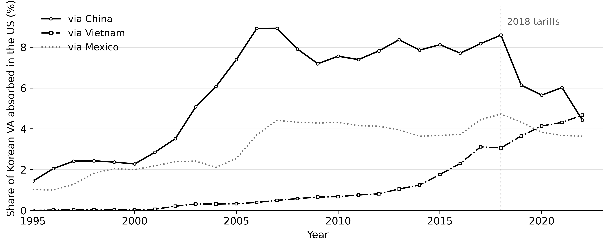
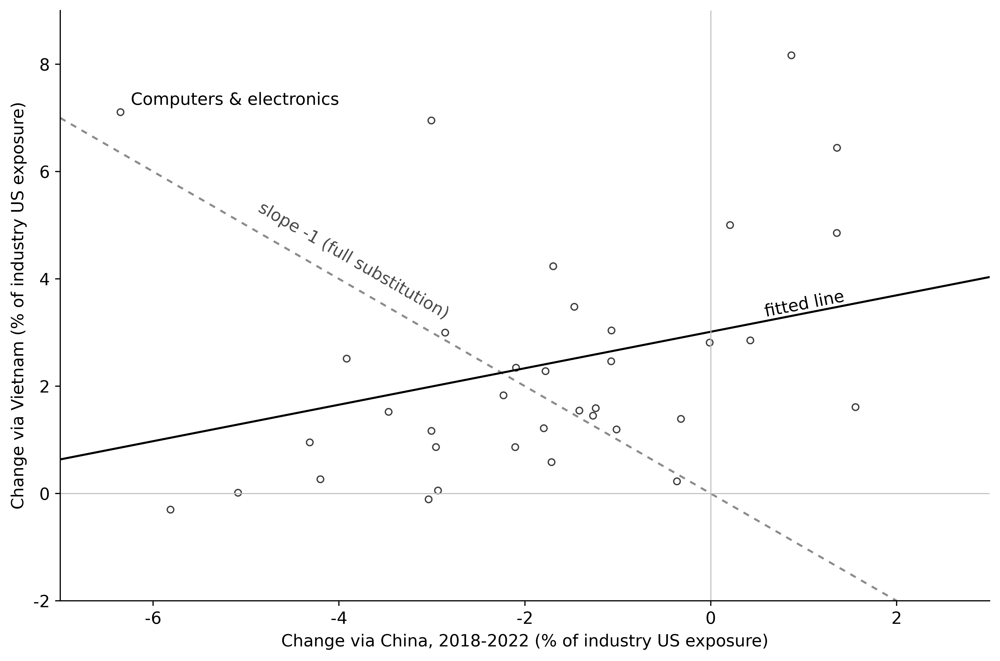

# 중국을 거친 한국 부가가치는 어디로 가는가: 2018년 미중 무역분쟁 전후의 최종 귀착 분해

Where Does Korean Value Added Go after China? A Final-Destination Decomposition around the 2018
Trade War

작성: 2026-09-07

---

## 요약

한국의 대중 수출을 설명하는 통념이 있다. 대중 수출의 80% 이상이 중간재이고 그것이 중국에서 조립되어
미국으로 나간다는 것이다. 2018년 미국의 대중 관세를 앞두고, 당사자가 아닌 한국의 수출이 줄어든다는
피해 예측이 여기서 나왔다. 이 통념에는 한국이 중국에 무엇을 파는가라는
구성의 명제와 그것이 어디로 가는가라는 목적지의 명제가 겹쳐 있는데, 구성은 널리 확인되었으나 목적지는 사후에
측정된 적이 없다. 본 연구는 OECD 국가간산업연관표에서 한국의 부가가치 전액을 최종재의 마지막 생산지와 최종
흡수지라는 두 축으로 분해해 목적지를 규명한다. 결과는 네 가지다. 첫째, 구성의 명제는 성립해 한국의 대중
수출에서 중간재는 2022년에도 78.5%다. 둘째, 목적지의 명제가 가리키는 경로는 정점에서도 작았다. 중국이 미국에 파는 것에서
한국 몫은 28개 연도 내내 3%를 넘은 적이 없고, 중국산 최종재에 체화된 한국 부가가치 가운데 약 77%는 중국
자신이 소비한다. 즉, 중국을 거친 한국 부가가치가 최종적으로 귀착하는 곳은 미국이 아니라 중국 내수다. 셋째,
미국 최종수요가 흡수한 한국 부가가치 가운데 중국산 최종재를 거친 몫은 2019년에 크게 줄어든 뒤 회복되지
않았고, 2022년에는 베트남을 거친 몫이 이를 넘어섰다. 다만 이 대체의 절반은 컴퓨터·전자·광학기기 한 산업에서
일어났다. 넷째, 중국산 최종재를 거쳐 미국 최종수요에 흡수된 부가가치의 금액으로 보면 그 감소는 한국에서
두드러진다. 79개 공급 경제의 대다수는 오히려 늘어 중위값이 5.4% 증가인 반면 한국은 33.0% 줄어 거의 맨 밑에
있다. 그러나 이 감소가 관세, 중국의 국산화, 한국 기업의 생산기지 이전 가운데 무엇에서 비롯했는지는 이 자료로
식별할 수 없다.

주제어: 글로벌 가치사슬, 부가가치 무역, 미중 무역분쟁, 국가간산업연관표, 공급망 재편

---

## I. 서론

미국이 2018년 7월 6일 340억 달러 규모의 중국산 수입품에 25% 관세를 부과하면서 시작된 무역분쟁은
2019년 9월까지 네 차례에 걸쳐 확대되었다. 한국에서 이 사건은 처음부터 간접 피해의 문제로 다루어졌다.
한국은 관세의 당사자가 아니지만 한국의 대중 수출 대부분이 중간재이고 그 중간재가 중국에서 조립되어
미국으로 나간다면, 미국이 중국산 완제품에 관세를 부과할 때 중국의 대미 수출이 줄고 그만큼 중국의
한국산 중간재 수입도 줄어든다는 논리다. 이 논리는 정책 대응의 전제가 되었고 계량적 추정으로도
뒷받침되었다. 이창수·송백훈(2018)은 아시아개발은행 다지역산업연관표에 Wang, Wei & Zhu (2013)의
분해(이하 WWZ)를 적용해 중국의 대미 수출에 체화된 한국 부가가치를 계산하고 25% 관세 시나리오에서
한국 수출이 103.3억~132.6억 달러 감소한다고 추정했다.

이 통념은 지금도 반복된다. Jones (2026)는 한국의 대중 수출의 약 80%가 중국 내 최종 생산에 쓰이는
중간재이고 그 제품의 상당 부분이 결국 미국으로 선적된다고 서술한다. 그런데 이 한 문장에는 성질이 다른
두 명제가 겹쳐 있다. 하나는 한국이 중국에 무엇을 파는가라는 구성의 명제이고, 다른 하나는 그것이
어디로 가는가라는 목적지의 명제다. 둘을 잇는 것은 "상당 부분"이라는 미정의 표현 하나다.
구성의 명제가 참이라고 해서 목적지의 명제가 따라 나오지 않는다. 중국에 들어간 중간재는 중국 자신의
최종수요로 흡수될 수도 있기 때문이다.

본 연구가 측정하는 것이 목적지의 명제다. 질문은 두 가지다. 한국 부가가치가 중국을 거쳐 미국
최종수요에 도달하는 몫은 얼마인가, 그리고 그 몫은 관세 이후 어떻게 변했는가. 앞의 물음에 대해 기존
추정은 모두 2018년 시점의 사전 시뮬레이션이며 관세가 실제로 부과된 뒤 이 경로가 어떻게 되었는지를
측정한 연구는 확인되지 않는다. 자료가 2022년까지 공표되면서 사후 4개 연도가 확보되었고, 이 연구는 그
기간을 대상으로 한다.

자료 쪽의 이유도 있다. 이 물음에 답하려면 총액 무역통계로는 부족하다. 한국이 중국에
판매한 중간재가 중국 안에서 몇 단계를 더 거쳐 어느 나라의 최종수요로 흡수되는지는 세계 전체의
투입산출 구조를 풀어야 알 수 있다. 총액 통계는 거래의 직전 상대만 기록하기 때문이다. 선행연구의 사전
시뮬레이션들이 아시아개발은행 다지역산업연관표를 쓴 것도 같은 이유다.

이 논문이 다루는 국면의 경계를 밝혀 둔다. 여기서 다루는 것은 2018년에 시작된 관세 국면이고, 현재
이용할 수 있는 자료는 2022년에서 끝난다. 그 뒤에 이어진 국면은 구성이 다르다. 관세의 당사자가
아니어서 간접 피해를 걱정하던 한국이 스스로 관세 부과 대상이 되었고, 물품이 제3국에서 실제로
만들어졌는지 아니면 그곳을 거쳐 가기만 했는지를 가려 관세를 달리 매기는 것이 하나의 정책 수단이
되었다. 둘 다 이 논문의 관측 기간 밖에 있으며 국가간산업연관표가 그 기간을 담기까지는 여러 해가
걸린다. 그러므로 이 논문은 뒤이은 국면을 진단하지 않는다. 이 논문이 하는 일은 그 국면에 들어서기
직전까지 중국을 거친 한국 부가가치가 실제로 얼마였고 어디로 향했는지를 확정하는 것이며, 이후의
변화는 이 값과 비교해야 드러난다.

---

## II. 선행연구와 본 연구의 위치

가장 가까운 선행연구가 이창수·송백훈(2018)이다. 아시아개발은행 다지역산업연관표에 WWZ 분해를 적용해
*중국의 대미 수출에 체화된 한국 부가가치*를 산업별로 계산하고, 미국이 중국산 수입에 25% 관세를
부과하는 시나리오를 분석했다. 결과는 관세에 따른 중국의 대미 수출 감소를 두 가지로 가정한 실험에서
한국 수출이 각각 103.3억 달러와 132.6억 달러 감소하는 것이다. 이 둘은 중국의 수출 감소에 한국
부가가치 비중을 곱한 직접효과여서 세계 투입산출 연관의 파급효과가 빠져 있다. 첫째 가정에
산업연관분석으로 파급효과를 더하면 감소폭이 165.8억 달러로 커진다. 감소의 절반이 전자·광학기기에 몰리고 금속·화학·기계가 뒤따르며, 대만은 비슷한 영향을 받고 일본은 그렇지
않은 것으로 나왔다.

이 연구와 본 연구는 세 가지에서 나뉜다. 첫째, 사전과 사후다. 그들의 연구는 관세가 부과되기 전
시나리오 실험이고 본 연구는 2022년까지의 실측이다. 둘째, 총수출 기준(gross exports)과 최종흡수
기준(final absorption)이다. 그들의 연구가 측정하는 것은 중국이 미국에 파는 것 전부에 체화된 한국
부가가치이고, 본 연구의 주 척도는 그중 중국산 최종재에 체화되어 미국 최종수요에 팔린 몫이다. 셋째, 가공무역의
분리다. 본 연구는 중국을 가공무역 부문과 가공무역 제외 부문으로 나눈 OECD 국가간산업연관표의
확장판을 쓰므로 중국 경유 노출의 변화가 가공무역에서 비롯한 것인지를 구분할 수 있다.

나뉘는 지점이 셋이지만 두 연구의 기준 척도는 한 곳에서 직접 비교할 수 있다. 이창수·송백훈(2018)은
중국의 대미 재화수출이 5,000억 달러일 때 거기에 체화된 한국 부가가치를 143.7억 달러, 곧 2.87%로
계산했다(2016년 표 기준). 그들의 연구와 조건을 맞춰 재화만 분리한 다음, 본 연구의 자료로 계산하면 2016년과 2017년 모두
2.32%다. 비율로 따지면 그들의 값이 24% 높은데 원표가 다르고(아시아개발은행 61개 경제 및 35개 산업 vs OECD 81개
경제 및 50개 산업) WWZ가 세는 항의 범위도 부가가치 전체와 같지 않아, 어느 쪽이 더 크게
작용했는지는 이 자료로 구분할 수 없다. 다만 두 계산이 함께 말하는 것이 있다. 이 비중이 어느
원표에서든 2~3% 수준이라는 것이며, 뒤에서 보일 "정점에서도 작았다"는 결론이 자료 선택에서 나온 것이
아님을 뜻한다. 산업 구성에서도 겹치는 데가 있다. 그들의 연구는 감소의 절반가량이 전자·광학기기에
몰릴 것으로 예측했고 본 연구의 실측에서도 컴퓨터·전자·광학기기가 중국 경유 감소분의 48%를 차지한다.
다만 앞은 예측된 총수출 감소의 구성이고 뒤는 실현된 부가가치 감소의 구성이므로 두 비중이 같은 대상을
가리키지는 않는다.

미국 쪽 문헌은 다른 질문을 물었다. 초기의 관심은 관세의 전가(pass-through)였고, 2022년 이후로는 우회(rerouting)와
재배치(reallocation)의 구분으로 옮겨갔다. Alfaro & Chor (2023)는 2017년부터 2022년까지 중국이 잃은
미국 수입 점유율의 절반 가까이를 베트남이 메웠다고 계산했고, Iyoha et al. (2025)은 2018년에서 2021년
사이 베트남의 대미 수출 증가액 528억 달러 가운데 우회에 해당하는 몫이 8.8%이고 39.8%는 베트남 국내
부가가치라고 계산해, 순수 경유가 증가분의 대부분을 설명하지는 않는다고 결론지었다. 이 문헌들의 관심사는 중국 부가가치가 제3국을 통해 여전히 미국에
들어오는가이지 한국 부가가치가 중국을 통해 들어오는가가 아니다. 한국은 이 논의의 대상이 아니었다.

한편 관세가 한국에 미친 영향을 피해 쪽에서만 본 것은 아니다. Lovely, Xu & Zhang (2021)은 한국이
관세의 반사이익을 보았는지를 검토해, 미국의 제조업 수입에서 한국이 차지하는 몫이 0.9%, 관세 부과
품목에서는 1.0% 늘었다고 보고했다. 중국 경유 수요가 줄어 잃는 경로와 미국 시장에서 중국산을 대신해
얻는 경로는 같은 기간에 동시에 작동했고, 서로 다른 연구가 각각을 다루었다. 잃는 쪽은 산업연관표를
기반으로 한 사전 시뮬레이션으로, 얻는 쪽은 미국의 세번별 수입·관세 자료로 확인되었다. 본 연구가
사후에 측정하는 것은 앞의 경로, 곧 피해 예측이 전제한 중국 경유다.

---

## III. 자료와 척도

자료는 OECD 국가간산업연관표 2025년판의 확장판이다. 1995년부터 2022년까지 28개 연도에 걸쳐 80개
경제와 그 밖의 세계, 50개 산업을 담으며, 확장판은 이 가운데 중국과 멕시코의 생산을 각각 두 부문으로
나누어 둔다. 중국은 가공무역 부문(CN2)과 가공무역 제외 부문(CN1)으로 나뉜다.
확장판을 주 자료로 삼은 이유는 둘이다. 중국 경유 노출의 변화가 가공무역에서 비롯한 것인지를 묻는 것이
본 연구의 질문 하나이고, 중국이 관련된 지표는 확장판에서만 공표치와 일치한다. 이 일치로 보아 OECD의
공표 부가가치 무역 통계는 확장판을 기준으로 계산된 것으로 판단되나, OECD 문서에서 이를 명시한 문장은
확인하지 못했다.

본 연구는 중국을 거친 한국 부가가치가 어디로 가는지를 분석하기 위해 두 가지 척도를 사용한다. 둘 다
중국이 미국과 맺는 거래에 체화된 한국 부가가치를 측정하지만, 거래를 어디까지 보는지가 다르다. 첫 번째
척도는 본 연구의 주 척도인 *중국 경유 대미 노출*로서, 중국에서 완성되어 미국의 최종수요가 소비한
최종재에 체화된 한국 부가가치다. 이 척도는 최종흡수 기준으로서 최종재에 체화된 것만 포함한다. 예컨대 한국에서 만든 반도체가 중국에서 스마트폰에
조립되고 그 스마트폰을 미국 소비자가 산다면, 해당 반도체에 체화된 한국 부가가치는 첫 번째 척도에
들어간다. 두 번째 척도는 중국의 대미 총수출에 체화된 한국 부가가치로서, 이창수·송백훈(2018)이 계산한
것과 같은 개념이며 선행연구와 비교하는 데 쓴다. 이 척도는 총수출 기준으로서 중국이 미국에
파는 중간재까지 포함한다. 앞의 예에서 중국이 해당 반도체를 넣은 부품을 미국 공장에 팔고 미국이
그것으로 완제품을 만든다면, 그 한국 부가가치는 두 번째 척도에는 들어가지만 첫 번째 척도에는 들어가지
않는다.

첫 번째 척도는 한국 부가가치 전액을 두 축으로 분해한 결과에서 얻는다. 한 축은 그 부가가치가 체화된
최종재가 마지막으로 만들어진 나라, 곧 *마지막 생산지*이고, 다른 축은 그 최종재를 소비한 나라, 곧
*최종 흡수지*다. 한국 부가가치가 그 전에 몇 나라를 거쳤는지는 따지지 않는다. 첫 번째 척도는 이 분해에서
마지막 생산지가 중국이고 최종 흡수지가 미국인 조합이며, IV장은 같은 분해의 다른 조합, 곧 베트남에서
완성된 몫, 중국 내수가 흡수한 몫, 다른 공급국의 같은 조합도 함께 쓴다. 아래에서는 이 분해와 두 번째
척도의 계산을 차례로 설명한다.

이 분해의 계산은 두 단계로 이루어진다. 첫 단계에서는 각 산업의 생산물이 최종재로 한 단위 팔릴 때
거기에 한국 부가가치가 얼마나 체화되어 있는지를 구한다. 여기서 산업은 나라별 산업을 가리키며, 가령
한국의 전자산업과 중국의 전자산업은 서로 다른 산업이다. 산업 $j$의 산출 한 단위에 투입되는 산업 $i$의
중간재 $A_{ij}$를 원소로 하는 투입계수 행렬을 $A$, 단위행렬을 $I$, 레온티에프 역행렬을 $B=(I-A)^{-1}$, 산업별
산출 한 단위당 부가가치를 모은 벡터를 $v$라 하자. $v$에서 한국 산업 $n$의 값만 남기고 나머지를 0으로
둔 벡터를 $v^{(n)}$이라 하면, 산업 $k$의 생산물 한 단위가 최종수요로 팔릴 때 그 생산에 직접과 간접으로
들어간 한국 산업 $n$의 부가가치는 다음과 같다.

$$
U_{kn} = \left( v^{(n)\prime} B \right)_k \tag{1}
$$

레온티에프 역행렬은 공급망의 모든 단계에서 투입된 몫을 합산하므로, $U_{kn}$에는 한국 부품이 제3국의
중간재에 들어갔다가 다시 산업 $k$에 투입된 몫까지 포함된다.

둘째 단계에서는 이 체화량을 최종재 판매에 곱해 두 축으로 집계한다. 산업 $k$가 경제 $d$의 최종수요에
판매한 최종재를 $F_{k,d}$라 하면, 경제 $c$에서 만들어져 경제 $d$의 최종수요가 흡수한
최종재에 체화된 한국 산업 $n$의 부가가치는 다음과 같다.

$$
M_{n,c,d} = \sum_{k \in c} U_{kn} F_{k,d} \tag{2}
$$

합산 기호의 $k \in c$는 최종재를 만든 산업 가운데 경제 $c$에 속한 것만 더한다는 뜻이다. 따라서 $c$가
마지막 생산지, $d$가 최종 흡수지다. 중국과 미국에 속한 산업의 집합을 각각 $\text{CHN}$과 $\text{USA}$로
적고, 산업 $k$의 최종재 한 단위에 체화된 한국 부가가치 전체를 $u_k = \sum_n U_{kn}$이라 하면, 첫 번째
척도인 중국 경유 대미 노출은 다음과 같다.

$$
M_{\text{CHN},\text{USA}} = \sum_n M_{n,\text{CHN},\text{USA}} = \sum_{k \in \text{CHN}} u_k F_{k,\text{USA}} \tag{3}
$$

두 가지를 덧붙인다. 첫째, 이렇게 나눈 $M$을 모든 $n$, $c$, $d$에 대해 더하면 한국의 부가가치 총액과
같다. 한국 부가가치 전액이 마지막 생산지와 최종 흡수지의 어느 한 조합에 배분된다는 뜻이다. 이
항등식이 성립하려면 부가가치를 순생산물세(taxes less subsidies on intermediate and final products),
곧 중간재와 최종재에 부과된 세금에서 보조금을 뺀 값까지 포함해 정의해야 한다. 원표의 각 열에서 중간투입과 순생산물세,
부가가치를 더한 값이 총산출과 같으므로, 순생산물세를 빼면 그만큼이 어느 나라에도 배분되지 않고 남기
때문이다. 둘째, 두 축은 나라 단위로 읽는다. 확장판이 중국의 생산을 두 부문으로 나누어 두었으므로 $c$는
부문 단위로 계산해 IV.3절에서 가공무역을 따로 볼 수 있게 한 다음, 그 밖의 표에서는 중국 하나로
합친다. 흡수지 $d$는 처음부터 나라 단위다. 확장판이 나눈 것은 생산 쪽뿐이고 최종수요는 나라별 열
그대로이기 때문이다.

$\sum_{n,c,d} M$이 한국의 부가가치 총액과 같다는 항등식이 실제로 성립하는지를 매 연도 확인했다.
상대오차는 28개 연도에서 최대 $2.3 \times 10^{-5}$이다. 원표 자체도 각 열의 투입 합계와 총산출이
상대오차 $10^{-3}$ 수준까지만 일치하므로, 이 차이는 계산의 오류로 볼 수 없다.

두 번째 척도는 중국이 미국에 파는 것 전부, 곧 최종재와 중간재를 합친 중국의 대미 총수출을 대상으로
한다. 산업 $k$가 산업 $j$에 판 중간재를 $Z_{kj}$라 하면, 중국의 대미 총수출에 체화된 한국 부가가치
$G$는 다음과 같다.

$$
G = \sum_{k \in \text{CHN}} u_k \left( \sum_{j \in \text{USA}} Z_{kj} + F_{k,\text{USA}} \right) \tag{4}
$$

괄호 안의 앞 항 $\sum_{j \in \text{USA}} Z_{kj}$는 중국 산업 $k$가 미국 산업에 판 중간재이고, 뒤 항
$F_{k,\text{USA}}$는 미국 최종수요에 판 최종재다. 뒤 항만 남기면 식 (3)이 되므로, 두 척도의
차이는 정확히 앞 항, 곧 중국이 미국 산업에 판 중간재에 체화된 한국 부가가치다.

---

## IV. 분석 결과

### 1. 통념의 두 명제: 구성과 목적지

서론에서 구분한 두 명제를 차례로 검증한다. 먼저 구성의 명제는 한국의 대중 수출 가운데 중간재의 몫이다.
한국의 대중 중간재 수출은 중간재 거래 행렬 $Z$에서 한국 산업의 행과 중국 산업의 열이 만나는 부분행렬의
합이고, 한국의 대중 최종재 수출은 최종수요 행렬 $F$에서 한국 산업의 행과 중국 최종수요의 열이 만나는
값의 합이다. 표 1은 그 둘과 각각의 비중을 연도별로 보여준다.

**표 1. 한국의 대중 수출 구성 (십억 달러)**

| 연도 | 중간재 | (비중) | 최종재 | (비중) |
|---|---|---|---|---|
| 2000 | 17.9 | (82.6%) | 3.8 | (17.4%) |
| 2010 | 87.5 | (71.2%) | 35.5 | (28.8%) |
| 2015 | 147.2 | (81.8%) | 32.8 | (18.2%) |
| 2018 | 170.6 | (76.7%) | 51.9 | (23.3%) |
| 2020 | 136.5 | (78.5%) | 37.4 | (21.5%) |
| 2022 | 153.0 | (78.5%) | 41.9 | (21.5%) |

주: 괄호 안은 대중 수출 전체에서 차지하는 비중이다.

자료: OECD (2025) 국가간산업연관표 2025년판 확장판에서 계산.

표에서 보듯이 구성의 명제는 성립한다. 중간재 비중은 2010년의 71.2%를 저점으로 대체로 77~82% 사이에
있고 2022년 78.5%다. 표에 싣지 않은 연도까지 넣으면 28개 연도의 평균이 78.4%이고 그중 22개 연도가
75%를 넘어, 이 비중은 최근에 생긴 것이 아니라 관측 기간 내내 유지된 구조다. 통념으로 이야기되는 "80% 이상"은 실제보다
조금 높게 잡은 것이지만 이 명제의 성립 여부를 바꾸지는 않는다. 결국 통념의 첫 번째 절반은 고칠 것이
없으며, 본 연구가 다루는 것은 나머지 절반이다.

목적지의 명제는 부가가치를 추적해야 답할 수 있다. 표 2는 중국의 대미 총수출과 거기에 체화된 한국
부가가치(VA)를 총수출 기준과 최종흡수 기준으로 함께 보여준다. 총수출 기준 열은 두 번째 척도인 식 (4)의
값으로, 선행연구가 계산한 것과 같은 개념이다. 마지막 열은 본 연구의 주 척도인 첫 번째 척도, 곧 식
(3)의 값으로,
중국의 대미 총수출에 체화된 한국 부가가치 가운데 중국산 최종재에 체화되어 미국 최종수요에 팔린 몫이다.

**표 2. 중국의 대미 수출에 체화된 한국 부가가치 (십억 달러)**

| 연도 | 중국의 대미 총수출 | 한국 VA, 총수출 기준 | (비중) | 한국 VA, 최종흡수 기준 |
|---|---|---|---|---|
| 2004 | 150.5 | 4.27 | (2.84%) | 2.92 |
| 2010 | 278.9 | 5.23 | (1.87%) | 3.68 |
| 2015 | 427.6 | 8.20 | (1.92%) | 6.14 |
| 2017 | 427.7 | 8.90 | (2.08%) | 6.40 |
| 2018 | 473.6 | 9.72 | (2.05%) | 6.79 |
| 2019 | 418.2 | 7.06 | (1.69%) | 4.75 |
| 2020 | 418.9 | 6.45 | (1.54%) | 4.35 |
| 2021 | 519.9 | 8.53 | (1.64%) | 5.72 |
| 2022 | 532.2 | 6.78 | (1.27%) | 4.55 |

주: 괄호 안은 중국의 대미 총수출 대비 비중이다.

자료: OECD (2025) 국가간산업연관표 2025년판 확장판에서 계산.

표에서 보듯이 목적지의 명제가 가리키는 비중은 정점에서도 작았고, 2019년에 다시 한 단계 낮아졌다. 두 번째
척도로 보면 중국이 미국에 파는 것에서 한국 몫은 2004년의 2.84%가 정점으로, 관세 부과보다 14년 앞선다. 28개 연도를 통틀어 3%를 넘은 해가 없다.
2010년대에는 1.8~2.1% 사이에 머물렀으나 2019년 1.69%로 내려간 뒤 그 범위를 회복하지 못하고 2022년 1.27%가
되었다. 비중 대신 금액으로 보면 정점의 해가 달라져 2018년의 97.2억 달러가 최대다. 이 금액은 2022년에 67.8억
달러로 30% 줄었는데, 같은 기간 중국의 대미 총수출은 5,322억 달러로 오히려 12% 늘었다. 한국 부가가치가
줄어든 것은 중국이 미국에 덜 팔아서가 아니라, 중국의 대미 수출에 체화된 한국 부가가치의 비중이 작아졌기
때문이다. 첫 번째 척도인 식 (3)으로 보아도 결론은 같다. 그 값은 표의
모든 연도에서 식 (4)의 67~75%로 안정적이고, 2018년에서 2022년 사이에 33% 줄어 두 번째 척도와 거의 같은
폭으로 내려간다.

### 2. 미국 최종수요에 대한 한국의 경로별 노출

이제 대상을 바꾸어 미국의 최종수요가 흡수한 한국 부가가치 전체를 놓고 그것이 어느 경로로
도달했는지를 구분한다. 표 3의 열은 마지막 생산지다. 한국 열은 한국이 만든 최종재를 미국이 사는 직접
경로이고, 미국 열은 한국 부가가치가 직접 또는 제3국을 거쳐 미국에서 만들어진 최종재에 체화되는 경로이며, 나머지
열은 제3국이 최종재를 만든 경로다. 표는 식 (2)에서 최종 흡수지 $d$를 미국으로 두고 한국의 모든 산업 $n$에
대해 더한 값을 마지막 생산지 $c$별로 구해 연도별로 보여주며, 이 가운데 중국 열이 첫 번째 척도, 곧 식
(3)의 값이다.

**표 3. 미국 최종수요가 흡수한 한국 부가가치의 마지막 생산지별 구성 (십억 달러)**

<!-- DOCX 전환 지침: 머리글은 한 줄이고, 자료 칸은 합계 열을 포함해 모두 한 칸 안에서 두 줄이다.
     윗줄이 금액, 아랫줄이 괄호 안의 구성비다. 아래   가 그 줄바꿈 자리다. -->

| 연도 | 한국 | 미국 | 중국 | 베트남 | 멕시코 | 기타 | 합계 |
|---|---|---|---|---|---|---|---|
| 2010 | 21.3 (43.8%) | 17.6 (36.1%) | 3.7 (7.6%) | 0.3 (0.7%) | 2.1 (4.3%) | 3.7 (7.6%) | 48.7 (100.0%) |
| 2015 | 35.8 (47.4%) | 24.7 (32.7%) | 6.1 (8.1%) | 1.3 (1.8%) | 2.8 (3.7%) | 4.8 (6.3%) | 75.5 (100.0%) |
| 2017 | 36.1 (46.2%) | 24.6 (31.5%) | 6.4 (8.2%) | 2.4 (3.1%) | 3.5 (4.5%) | 5.2 (6.6%) | 78.3 (100.0%) |
| 2018 | 35.5 (44.9%) | 25.0 (31.7%) | 6.8 (8.6%) | 2.4 (3.1%) | 3.7 (4.7%) | 5.5 (7.0%) | 79.0 (100.0%) |
| 2019 | 35.9 (46.3%) | 25.7 (33.1%) | 4.8 (6.1%) | 2.8 (3.7%) | 3.4 (4.3%) | 5.0 (6.4%) | 77.4 (100.0%) |
| 2020 | 36.5 (47.4%) | 25.2 (32.8%) | 4.3 (5.7%) | 3.2 (4.1%) | 2.9 (3.8%) | 4.8 (6.2%) | 76.9 (100.0%) |
| 2021 | 42.5 (44.8%) | 33.2 (34.9%) | 5.7 (6.0%) | 4.1 (4.3%) | 3.5 (3.7%) | 6.0 (6.3%) | 95.0 (100.0%) |
| 2022 | 46.2 (45.0%) | 36.7 (35.8%) | 4.5 (4.4%) | 4.8 (4.7%) | 3.7 (3.6%) | 6.6 (6.5%) | 102.6 (100.0%) |

주: 각 칸의 윗줄은 금액, 아랫줄 괄호 안은 합계 대비 구성비다.

자료: OECD (2025) 국가간산업연관표 2025년판 확장판에서 계산.

구성비로 보면 중국 경유는 2018년 8.6%에서 2019년 6.1%로 떨어진 뒤 2022년 4.4%까지 내려간다.
같은 기간 베트남 경유는 3.1%에서 4.7%로 올라 2022년에 중국을 추월한다. 이 기간 중 전체 노출은 790억
달러에서 1,026억 달러로 오히려 커졌으므로, 줄어든 것은 노출 자체가 아니라 중국을 지나는 경로다.
그림 1은 중국·베트남·멕시코 세 경유 경로의 구성비 추이를 보여준다.

**그림 1. 제3국 경유 경로의 구성비 추이 (미국 최종수요가 흡수한 한국 부가가치 대비, %)**

자료: OECD (2025) 국가간산업연관표 2025년판 확장판에서 계산.

그림은 세 가지를 보여준다. 중국 경유는 2006~2007년에 이미 8.9%로 정점을 찍고 이후 11년 동안 7~9%
사이에서 평평했다는 것, 2018년의 8.6%가 그 평평한 구간의 마지막이라는 것, 그리고 2019년의 하락 폭
2.5%p가 그 이전 어느 해의 변동(최대 1.6%p)보다도 크다는 것이다. 시점이 관세와 겹치지만 이것만으로
하락을 관세 하나로 돌릴 수는 없다(V장). 멕시코 경유가 2018년을 정점으로 함께 내려가고 베트남 경유만
올라가는 것도 확인된다.

### 3. 중국 경유의 내부: 가공무역과 중국 내수

이 절에서는 중국에서 완성된 최종재에 체화된 한국 부가가치를 대상으로, 그 최종재가 어디서 소비되는지를
분석한다. 표 4는 식 (2)에서 마지막 생산지 $c$를 중국의 두 부문으로 두고 한국의 모든 산업 $n$에 대해 더한
값을 두 기준으로 구분한다. 하나는 최종재를 만든 부문이 가공무역인지 가공무역 제외인지이고, 다른 하나는 그
최종재를 흡수한 곳, 곧 최종 흡수지 $d$로서 중국 내수, 미국, 제3국으로 구분한다. 단, 가공무역 부문의 산출은 정의상 전량 수출되므로 중국 내수에
해당하는 열이 없다. 두 미국 열을 더한 값이 첫 번째 척도, 곧 식 (3)이므로, 이 표는 첫 번째 척도가 중국산
최종재에 체화된 한국 부가가치 전체에서 어느 정도를 차지하는지도 보여준다.

**표 4. 중국산 최종재에 체화된 한국 부가가치의 부문별·흡수지별 구성 (십억 달러)**

<!-- DOCX 전환 지침: 머리글을 두 줄로 만든다. 둘째~넷째 열은 윗줄의 「가공무역 제외」를 세 칸으로
     가로 병합해 하나로 두고, 다섯째·여섯째 열은 「가공무역」을 두 칸으로 병합한다. 아랫줄에는
     각각 중국내수·미국·제3국, 미국·제3국을 둔다. 첫 열과 끝의 두 열은 위아래 두 줄을 세로 병합한다.
     아래   가 그 줄바꿈 자리다. -->

| 연도 | 가공무역 제외 중국내수 | 가공무역 제외 미국 | 가공무역 제외 제3국 | 가공무역 미국 | 가공무역 제3국 | 합계 | (총VA 대비) |
|---|---|---|---|---|---|---|---|
| 2010 | 35.01 | 0.85 | 2.50 | 2.83 | 7.41 | 48.60 | (4.47%) |
| 2015 | 70.73 | 1.60 | 4.79 | 4.54 | 11.06 | 92.72 | (6.65%) |
| 2017 | 73.95 | 1.72 | 5.08 | 4.68 | 11.91 | 97.33 | (6.31%) |
| 2018 | 83.85 | 1.83 | 5.41 | 4.96 | 12.02 | 108.07 | (6.59%) |
| 2019 | 71.73 | 1.17 | 4.13 | 3.58 | 11.17 | 91.79 | (5.85%) |
| 2020 | 70.08 | 1.26 | 4.57 | 3.09 | 10.03 | 89.02 | (5.70%) |
| 2021 | 85.61 | 1.65 | 6.20 | 4.07 | 13.68 | 111.21 | (6.02%) |
| 2022 | 71.38 | 1.32 | 5.14 | 3.22 | 12.09 | 93.15 | (5.41%) |

주: 괄호 안은 그해 한국 부가가치 총액에서 차지하는 비중이다.

자료: OECD (2025) 국가간산업연관표 2025년판 확장판에서 계산.

표는 통념이 고려하지 않은 부분을 보여준다. 2022년 중국산 최종재에 체화된 한국 부가가치 931.5억 달러 가운데
중국 자신이 소비한 것이 713.8억으로 76.6%다. 미국행은 45.5억으로 4.9%에 지나지 않는다. 한국의
중간재가 중국으로 가는 것은 맞지만 그 대부분은 미국으로 나가지 않고 중국 안에 머문다. 한국이 중국에
갖는 노출의 실체는 우회가 아니라 중국 내수인 것이다. 더구나 대미 경로 안에서는 가공무역이 더 크게 줄었다.
2018년에서 2022년 사이에 가공무역을 거친 대미분은 49.6억 달러에서 32.2억 달러로 35% 줄어, 가공무역
제외를 거친 대미분이 18.3억 달러에서 13.2억 달러로 28% 줄어든 것보다 감소 폭이 크다. 다음 절에서는
대상을 다시 대미 경로로 좁혀, 이 축소가 어느 산업에서 일어났고 그만큼이 베트남 경유에서 늘었는지를
검토한다.

### 4. 산업별: 무엇이 어디로 옮겨갔나

집계에서 중국 경유가 줄고 베트남 경유가 늘었다는 것만으로는 경로가 옮겨갔다고 말할 수 없다. 두
변화가 우연히 크기만 맞은 것일 수 있기 때문이다. 옮겨간 것이라면 중국에서 줄어든 산업과 베트남에서
늘어난 산업이 같아야 한다. 이를 확인하기 위해 산업별로 두 경로의 변화를 비교한다. 대상은 2018년 중국
경유와 2022년 베트남 경유가 모두 1천만 달러에 못 미치는 산업을 제외한 36개 산업이다. 두 경로 자체가
작은 산업은 그 변화가 잡음에 가깝기 때문이다. 표 5는 이 가운데 2018년 중국 경유가 큰 10개 산업의
2018년과 2022년 값, 그리고 그 변화를 보여준다. 두 경로의 값은 식 (2)에서 최종 흡수지 $d$를 미국으로,
마지막 생산지 $c$를 각각 중국과 베트남으로 둔 값을 부가가치가 발생한 한국 산업 $n$별로 구한 것이다.

**표 5. 중국 경유 대미 노출 상위 10개 산업 (백만 달러)**

<!-- DOCX 전환 지침: 머리글을 두 줄로 만든다. 윗줄에서 둘째~넷째 열은 「중국 경유」를, 다섯째~일곱째 열은
     「베트남 경유」를 각각 세 칸으로 가로 병합한다. 아랫줄에는 차례로 2018·2022·변화, 2018·2022·변화를
     둔다. 첫 열은 위아래 두 줄을 세로 병합한다. 아래   가 그 줄바꿈 자리다. -->

| 산업 | 중국 경유 2018 | 중국 경유 2022 | 중국 경유 변화 | 베트남 경유 2018 | 베트남 경유 2022 | 베트남 경유 변화 |
|---|---|---|---|---|---|---|
| 컴퓨터·전자·광학기기 | 3,100 | 2,044 | −1,056 | 788 | 1,969 | +1,181 |
| 도소매·자동차수리 | 901 | 599 | −302 | 347 | 664 | +317 |
| 화학 | 436 | 286 | −151 | 171 | 268 | +97 |
| 전문·과학·기술서비스 | 253 | 145 | −108 | 96 | 140 | +44 |
| 사업지원서비스 | 171 | 118 | −53 | 51 | 94 | +43 |
| 금융·보험 | 152 | 109 | −44 | 61 | 117 | +56 |
| 전기장비 | 134 | 106 | −28 | 55 | 119 | +64 |
| 고무·플라스틱 | 127 | 83 | −44 | 96 | 125 | +30 |
| 기타 기계·장비 | 121 | 63 | −59 | 42 | 62 | +20 |
| 창고·운송지원 | 106 | 62 | −44 | 33 | 53 | +19 |

주: 2018년 중국 경유 규모 순이며, 부가가치가 발생한 한국 산업 기준이다.

자료: OECD (2025) 국가간산업연관표 2025년판 확장판에서 계산.

표에서 보듯이 변화의 규모는 컴퓨터·전자·광학기기에서 가장 크다. 이 산업에서 중국 경유가 10.6억 달러 줄고
베트남 경유가 11.8억 달러 늘어, 산업 하나 안에서 상당히 비슷한 규모로 상쇄된다. 36개 산업 전체로 넓히면 중국
경유는 22.2억 달러 줄고 베트남 경유는 23.6억 달러 늘었으며, 그 감소분의 48%와 증가분의 50%가
컴퓨터·전자·광학기기 한 산업에서 발생한다. 산업별 두 변화의 피어슨 상관은 -0.987, 회귀계수는 -1.094다.
컴퓨터·전자·광학기기를 빼도 상관은 -0.858, 회귀계수는 -0.824로 음의 관계가 뚜렷하고, 합계도 -11.7억 달러
대 +11.8억 달러로 거의 상쇄된다.

그러나 여기에 유보가 붙는다. 금액 그대로의 상관은 산업의 크기를 반영한다. 큰 산업은 두 방향 모두에서
크게 움직이므로 상관이 높게 나오는 것이 당연하다. 그래서 36개 산업 각각에 대해 두 경로의 변화를 그
산업의 2018년 대미 노출 전체로 나누어 상대 변화를 구한다. 분모는 경로를 가리지 않고 미국 최종수요가
흡수한 그 산업의 한국 부가가치, 곧 식 (2)에서 $d$를 미국으로 두고 모든 $c$에 대해 더한 값이며, 표 3의
합계를 산업별로 구한 것에 해당한다. 그 크기는 가령 컴퓨터·전자·광학기기의 경우 166억 달러다. 이것을 그린 것이 그림 2로, 점 하나가 산업 하나이고 가로축이 중국 경유의 상대 변화,
세로축이 베트남 경유의 상대 변화다. 산업마다 경로가 옮겨간 것이라면 중국에서 줄어든 만큼 베트남에서
늘어야 한다. 그 대체가 완전한 극단에서는 점들이 기울기 -1의 점선 위에 놓인다.

**그림 2. 산업별 상대 변화, 2018→2022 (각 산업의 2018년 대미 노출 대비 %p)**

자료: OECD (2025) 국가간산업연관표 2025년판 확장판에서 계산.

그림의 점들에 대해 상관을 구하면 +0.305이고 컴퓨터·전자·광학기기를 빼면 +0.531이다. 부호가 양이라는
것은 중국 경유의 감소가 큰 산업일수록 베트남 경유의 증가가 작았다는 뜻이므로, 산업마다 경로가
옮겨갔다는 해석과 맞지 않는다. 따라서 결론은 이렇게 좁혀야 한다. 집계 수준의 상쇄는 실재하고 그
절반은 컴퓨터·전자·광학기기 한 산업에서 발생하며 그 산업 안에서는 대체가 뚜렷하다. 그러나 그것이 경제
전반에서 일률적으로 일어난 경로 이전은 아니다. 나머지 산업에서 중국 경유가 줄어든 것과 베트남 경유가
늘어난 것은 서로 다른 사정으로 보아야 한다.

### 5. 한국은 공통 추세를 벗어났나

중국 경유 경로의 축소가 한국에만 일어난 일인지 중국에 중간재를 공급하는 모든 나라에 공통인지를
검토한다. 표 6은 그 밖의 세계와 중국을 뺀 공급 경제 79곳 각각에 대해 식 (3)을 한국 대신 그
나라의 부가가치로 계산하여 그 나라 부가가치 가운데 중국산 최종재에 체화되어 미국 최종수요에 팔린
금액을 구하고 2018년 대비 2022년의 변화율을 비교한 것이다. 다만 이
비교에서 다른 공급국은 통제군이 아니다. 처치(treatment)가 한국에만 부과된 것이라면 같은 조건의 타국을 통제군으로 삼아
인과효과를 추정할 수 있지만, 미국의 관세는 중국에 중간재를 공급하는 모든 나라의 중국 경유 경로에 함께
작용한다. 비교 대상도 처치를 받는 셈이므로 이 표가 보여주는 것은 관세의 인과효과가 아니라 한국의 축소가 공통
추세를 벗어난 정도다.

**표 6. 공급 경제별 중국 경유 대미 부가가치 (십억 달러)**

| 공급 경제 | 2017 | 2018 | 2019 | 2022 | (2018→2022 변화율) |
|---|---|---|---|---|---|
| 한국 | 6.40 | 6.79 | 4.75 | 4.55 | (−33.0%) |
| 일본 | 5.13 | 5.33 | 4.55 | 4.16 | (−21.9%) |
| 미국 | 5.01 | 5.15 | 4.06 | 4.90 | (−4.7%) |
| 대만 | 5.07 | 4.79 | 4.19 | 5.25 | (+9.6%) |
| 독일 | 2.40 | 2.62 | 2.31 | 2.37 | (−9.4%) |
| 호주 | 2.14 | 2.41 | 2.24 | 2.74 | (+13.7%) |
| 싱가포르 | 1.38 | 1.44 | 1.44 | 1.76 | (+22.0%) |
| 베트남 | 1.03 | 1.28 | 1.22 | 1.53 | (+19.2%) |

주: 2018년 중국 경유 규모 순이다.

자료: OECD (2025) 국가간산업연관표 2025년판 확장판에서 계산.

표에서 보듯이 한국의 감소는 극단에 속한다. 79개 공급 경제의 변화율 중위값이 +5.4%인 데 반해 한국은 -33.0%이며, 한국보다 더
크게 줄어든 경제는 하나뿐이다. 공급국×산업 단위로 보아도, 2018년 1천만 달러를 넘는 조합 가운데 한국 산업들의 변화율
중위값은 -31.2%인 데 반해 타국 산업들은 -5.7%다. 같은 시기 중국의 대미 총수출이 12%
늘었음을 감안하면, 중국의 대미 공급망에서 한국의 부가가치가 특히 빠르게 줄었다는 뜻이 된다. 다만 이
표는 왜 그런지를 말해 주지는 않는다. 관세, 중국의 국산화, 한국 기업의 생산기지 이전이 모두 후보이며 이
자료로는 각각의 기여를 식별할 수 없다.

### 6. 확장판과 표준판 대조

본 연구의 결과는 모두 확장판에서 계산했다. III장에서 적은 대로 확장판은 중국의 생산을 가공무역과 가공무역
제외로 나누는 반면, 표준판은 중국의 생산을 나누지 않는다. 두 버전은 같은 거래를 서로 다른 세밀도로 나눈
것이므로, 결론이 이 선택에 의존하는지는 계산해 보아야 판단할 수 있다. 표준판에서 같은 계산을 반복해 가공무역
분할이 결과를 얼마나 움직이는지 확인한다. 버전이 달라도 국경을 넘는 거래 자체는 같고 달라지는 것은 그 거래에
체화된 부가가치의 원천 배분뿐이므로, 차이는 중국을 경유하는 경로에서만 나타나야 한다. 표 7이 그 대조다. 중국 경유 대미는 첫 번째 척도인 식
(3)이고, 중국 생산 전체는 식 (2)에서 $c$를 중국으로 두고 모든 $n$과 $d$에 대해 더한 값으로 표 4의 합계와
같다.

**표 7. 확장판과 표준판 대조 (십억 달러)**

<!-- DOCX 전환 지침: 머리글을 두 줄로 만든다. 둘째~넷째 열은 윗줄의 「중국 경유 대미」를, 다섯째~일곱째
     열은 「중국 생산 전체」를 각각 세 칸으로 가로 병합한다. 아랫줄에는 양쪽 모두 확장판·표준판·(차이)를
     둔다. 첫 열은 위아래 두 줄을 세로 병합한다. 아래   가 그 줄바꿈 자리다. -->

| 연도 | 중국 경유 대미 확장판 | 중국 경유 대미 표준판 | 중국 경유 대미 (차이) | 중국 생산 전체 확장판 | 중국 생산 전체 표준판 | 중국 생산 전체 (차이) |
|---|---|---|---|---|---|---|
| 2010 | 3.68 | 3.40 | (−7.8%) | 48.60 | 49.29 | (+1.4%) |
| 2015 | 6.14 | 5.71 | (−7.0%) | 92.72 | 93.59 | (+0.9%) |
| 2018 | 6.79 | 6.28 | (−7.5%) | 108.07 | 109.21 | (+1.1%) |
| 2019 | 4.75 | 4.43 | (−6.8%) | 91.79 | 92.72 | (+1.0%) |
| 2022 | 4.55 | 4.26 | (−6.3%) | 93.15 | 94.13 | (+1.0%) |

주: 괄호 안은 확장판 대비 표준판의 차이다.

자료: OECD (2025) 국가간산업연관표 2025년판 표준판·확장판에서 계산.

표에서 보듯이 표준판은 중국 경유 대미분을 6~8% 낮게, 중국 생산 전체를 1% 높게 낸다. 그러나 본문의
결론은 이 차이에 의존하지 않는다. 차이의 크기와 방향이 다섯 연도 모두에서 안정적이므로 계열의 시간
경로가 바뀌지 않는다. 실제로 2018년에서 2022년 사이의 감소율은 확장판 33.0%, 표준판 32.2%로 거의 같다.
버전 선택이 바꾸는 것은 수준이지 변화가 아니며, 이 논문의 발견은 변화에 관한 것이다.

두 차이의 부호가 반대인 것은 표준판이 투입구조가 서로 다른 두 부문을 하나의 평균으로 묶기 때문이다.
가공무역 부문은 산출 대비 수입 중간재 비중이 2018년 13.3%로 가공무역 제외 부문의 4.4%보다 높다. 그래서
평균 투입구조를 쓰면 가공무역의 몫이 큰 대미 수출에서는 수입 투입이 실제보다 적게 잡히고, 그만큼 한국
부가가치도 낮게 잡힌다. 내수용 생산이 대부분인 중국 생산 전체에서는 같은 평균화가 반대로 작용한다.

---

## V. 관세 효과를 식별할 수 있는가

IV.2절은 미국 최종수요가 흡수한 한국 부가가치 가운데 중국산 최종재를 거친 몫이 2018년 8.6%에서 2019년
6.1%로 떨어진 뒤 2022년 4.4%까지 내려갔음을 보였고, IV.5절은 그 금액이 2018년에서 2022년 사이에 33.0%
줄어 79개 공급 경제 가운데 감소 폭이 극단에 속함을 보였다. 그러나 두 절은 이 축소가 얼마나 컸고 언제
일어났는지를 측정했을 뿐, 그것이 무엇에서 비롯했는지는 답하지 않는다. 이 장은 그 축소를 미국의 대중 관세에 돌릴 수 있는지를 검토한다. 결론을 먼저 적으면 이 자료로 관세의
효과는 식별되지 않는다. 식별에 쓸 처치강도(treatment intensity)의 변이가 거의 없고 평행추세(parallel
trends)도 성립하지 않기 때문이다. 아래에서는
관세를 처치로 삼는 이중차분(difference-in-differences) 설계를 세우고(1절), 그 추정 결과를
제시한 다음(2절), 두 문제가 어디에서 비롯하는지를 진단한다(3절). 이 결과를 싣는 것은 두 가지 이유에서다. 하나는 앞 장의 측정을 관세의 효과로 읽어서는
안 된다는 것을 보이기 위해서이고, 다른 하나는 어떤 자료와 설계가 있어야 이 물음에 답할 수 있는지를
분명히 하기 위해서다.

### 1. 설계

관세의 효과를 분리하려면 관세를 더 크게 받은 산업과 덜 받은 산업 사이의 차이가 있어야 한다. 그 차이를
처치강도로 삼는다.

이 장에서 산업 $i$는 나라를 구분하지 않은 50개 산업 분류를 가리키고, 나라는 $s$로 구분한다. 산업 $i$의
관세 노출도 $\text{exposure}_i$는 2017년 중국 산업 $i$의 총산출 가운데 대미 수출이 차지하는 비중(0~1)으로
정의한다. 관세가
중국의 대미 수출을 겨냥했으므로 이 비중이 높은 산업일수록 크게 노출된다. 식별은 이 노출도가 산업마다 다르다는
사실에 의존한다. 곧 처치강도의 변이가 있어야 한다. 연도를 2017년으로 고정한 것은 처치
이전 값이라야 처치의 영향을 받지 않기 때문이다. 관세가 2018년 7월에 시작되어 연 단위 자료의 2018년은 이미
절반이 처치를 받은 해이므로, 완전히 처치 이전인 마지막 해가 2017년이다. 노출도가 가장 높은 산업은
가구·기타제조로 2017년 총산출의 12.83%가 미국으로 나갔고, 컴퓨터·전자·광학기기 7.57%, 섬유·의복·가죽 4.92%가
그 뒤를 잇는다. 세율 대신 이 비중을 쓰는 것은 두
가지 이유에서다. 하나는 관세가 HS6 세번에 부과되는 데 반해 결과변수는 50개 산업 단위여서 층위가 맞지
않기 때문이고, 다른 하나는 같은 세율이라도 산출 가운데 대미 수출이 차지하는 몫이 클수록 충격이 크기
때문이다. 이 노출도는 실제 관세 부과를 대신하는 값이지 그것과 같지 않다. 미국이 관세 대상을 고른
기준은 대미 수출 의존도가 아니라 중국의 산업정책이었다. 301조 조사는 중국이 "중국제조 2025"에서 육성
대상으로 지목한 기술·산업재를 겨냥했고, 소비재는 2019년 9월의 4차 목록에서야 대부분 포함되었다. 그래서 둘이
어긋나는 산업이 생긴다. 예컨대 섬유·의복·가죽은 노출도가 4.92%로 세 번째지만 그것에 대응하는 HS 류의 관세 인상폭은
가장 낮은 축에 든다(V.3절). 이 어긋남 때문에 추정된 계수는 관세율이 1%p 오를 때의 반응이 아니라, 대미
수출 의존도가 높은 산업이 관세 이후 보인 상대적 움직임으로 해석해야 한다.

추정 모형의 결과변수 $M_{sit}$는 식 (2)에서 마지막 생산지 $c$를 중국, 최종 흡수지 $d$를 미국으로 둔
$M_{n,c,d}$를 공급 경제 $s$, 부가가치가 발생한 산업 $i$, 연도 $t$별로 계산한 것이다. 식 (2)의 $n$은
한국의 산업이었으나 여기서는 공급 경제가 79개로 늘어나므로, 그 자리를 공급 경제 $s$와 산업 $i$가 함께
맡는다. 곧 공급 경제 $s$의 산업 $i$에서 발생한 부가가치 가운데 중국산 최종재에 체화되어 미국 최종수요에
팔린 금액(백만 달러)이다. 이것을 $i$에 대해 더하면 공급 경제 $s$의 첫 번째 척도, 곧 식 (3)이 된다. 이
산업 $i$에는 같은 분류의 중국 산업 노출도를 대응시킨다. 이것은 공급국 산업 $i$에서 발생한 부가가치가
중국의 같은 분류 산업 $i$를 거쳐 미국으로 나간다고 가정하는 것이다. 실제로는 한국 화학산업의 부가가치가
중국 전자산업의 수출에 체화되기도 하므로, 그런 몫에는 실제와 다른 노출도가 대응되는 셈이다. 처치를 가리키는
$\text{post}_t$는 2019년 이후면 1, 그 전이면 0인 더미다. 관세가 2018년 7월부터 단계적으로 시행되어
2018년은 부분처치 연도이므로 기준을 2019년에 두었다. 이중차분 추정식은 다음과 같다.

$$
\log(1 + M_{sit}) = \alpha_{si} + \delta_{st} + \beta \left( \text{post}_t \times \text{exposure}_i \right) + \varepsilon_{sit} \tag{5}
$$

$\alpha_{si}$는 공급국×산업 고정효과, $\delta_{st}$는 공급국×연도 고정효과다. 뒤엣것이 각 공급국
고유의 대미 경기와 환율을 흡수하므로 식별은 같은 나라 안에서 노출도가 다른 산업 사이의 비교로
좁혀진다. 결과변수에 로그를 취한 것은 규모가 다른 공급국과 산업을 함께 놓기 위해서이고, 1을 더한 것은
$M_{sit}$의 단위가 백만 달러인데 표본의 56.5%가 1에 못 미쳐, 로그를 그대로 취하면 큰 음수로 벌어지기
때문이다. 표본은 2010년부터 2022년까지 공급 경제 79개와 관측이 있는 산업 49개이며, 부가가치가 양수인
관측 49,733개만 남긴 불균형 패널이다.

한국이 다른 공급국과 다르게 움직였는지는
삼중 상호작용 $\text{post}_t \times \text{exposure}_i \times \mathbf{1}\{s=\text{KOR}\}$ 을 더해
확인한다. 여기서 $\mathbf{1}\{s=\text{KOR}\}$ 은 공급국이 한국이면
1, 아니면 0인 지시변수이고, 이 항의 계수는 노출도가 같을 때 한국의 반응이 다른 공급국의 평균 반응과
얼마나 다른지를 나타낸다. 이 항을 넣으면 $\beta$ 는 한국을 제외한 공급국의 평균 반응이 된다. 표준오차는
처치 변이가 발생하는 산업 수준에서 군집화한다. 고정효과는 더미 변수 대신 교대 사영(alternating
projections)으로 소거한다(partial out). 공급국×산업만 3,800여 개여서 더미로 넣으면 모수가 군집 수
49개를 넘기 때문이다.

식별 가정인 평행추세가 성립하는지는 $\text{post}_t$를 연도 더미로 풀어 확인한다. 추정식은 다음과 같다.

$$
\log(1 + M_{sit}) = \alpha_{si} + \delta_{st} + \sum_{y \neq 2017} \beta_y \left( \mathbf{1}\{t = y\} \times \text{exposure}_i \right) + \varepsilon_{sit} \tag{6}
$$

$\beta_y$는 연도 $y$에 노출도가 1 높은 산업의 결과변수가 2017년 대비 얼마나 달라졌는지를 나타내며,
기준연도인 2017년의 계수는 0으로 고정된다. 노출도가 가장 높은 산업도 0.128이므로 계수의 크기는 그
비율만큼 줄여 읽어야 한다. 표본은 2012년부터 2022년까지이며, 평행추세가 성립한다면 처치 이전 연도의 계수들이 0 근처에 모여 있어야 하고, 크기도
처치 이후의 계수보다 뚜렷이 작아야 한다. 사전 계수가 0과 구분되지 않는 것만으로는 평행추세를 확인했다고
보기 어렵기 때문에 크기도 함께 본다(Roth, 2022).

### 2. 결과

표 8이 식 (5)의 이중차분 추정 결과다. 사양 1은 기본 사양이고 사양 2는 한국 삼중 상호작용을 더한
것이다. 노출도가 높은 산업일수록 중국 경유가 더 줄었어야 하므로 $\beta$ 는 음수를 기대한다. 추정치는
+0.396(표준오차 0.248)으로 부호가 기대한 것과 반대이고 0과 구분되지 않는다. 한국 삼중 상호작용은
−2.135(표준오차 1.106)로 방향은 맞으나 $t$값이 $-1.93$이다. 군집이 49개이므로 5% 임계값이 약 2.01이고,
따라서 이 계수도 통계적으로 유의하지 않다. 한국의 감소가 노출도가 같은 다른 공급국보다 컸는지는
이 추정으로 확인되지 않는다.

**표 8. 관세 노출을 처치강도로 삼은 이중차분 추정**

<!-- DOCX 전환 지침: 계수 칸은 한 칸 안에서 두 줄이며 윗줄이 계수, 아랫줄이 괄호 안의 표준오차다.
     아래   가 그 줄바꿈 자리다. 첫 열의 머리 칸과 「post × 노출도 × 한국」 행의 사양 1 열은
     비워 둔다. 「추정계수」 행은 아래 두 행을 묶는 구분 행이므로 값 칸을 비우고 첫 열의 라벨만
     남긴다. -->

| | 사양 1 | 사양 2 |
|---|---|---|
| 추정계수 | | |
| post × 노출도 | +0.396 (0.248) | +0.423 (0.242) |
| post × 노출도 × 한국 | | −2.135 (1.106) |
| 관측 | 49,733 | 49,733 |
| 산업 군집 수 | 49 | 49 |

주: 괄호 안은 산업 수준에서 군집화한 표준오차다.

자료: OECD (2025) 국가간산업연관표 2025년판 확장판에서 계산.

한편, 같은 자료를 식 (6)으로 다시 추정한 것이 표 9다. 이 설계에서 평행추세는 관세가 없었더라면 같은
나라 안에서 노출도가 높은 산업과 낮은 산업이 같은 추세를 따랐으리라는 가정이다. 그것이 성립하지
않는다는 점이 여기에서 더 분명하게 나타난다. 처치 이전인 2012년 −0.691, 2014년 +0.602, 2016년 +0.409가 사후 계수(2019년 +0.459,
2022년 −0.040)에 못지않은 크기로 변동하며, 이 사전 계수 셋은 모두 5% 수준에서 0과 구분된다($t$값 $-2.42$,
$2.36$, $2.36$). 처치 전에 이미 이만큼 변동하는 계열에서는 처치 이후의 움직임을 처치의 결과로 볼 수
없다.

**표 9. 이벤트 스터디 추정 (기준연도 2017년)**

| 연도 | 계수 | 표준오차 |
|---|---|---|
| 2012 | −0.691 | (0.285) |
| 2013 | +0.091 | (0.265) |
| 2014 | +0.602 | (0.255) |
| 2015 | +0.091 | (0.144) |
| 2016 | +0.409 | (0.173) |
| 2018 | −0.119 | (0.142) |
| 2019 | +0.459 | (0.151) |
| 2020 | +0.253 | (0.195) |
| 2021 | +0.490 | (0.331) |
| 2022 | −0.040 | (0.484) |

주: 각 연도 더미와 노출도의 상호작용 계수다. 표준오차는 산업 수준에서 군집화했다.

자료: OECD (2025) 국가간산업연관표 2025년판 확장판에서 계산.

### 3. 진단

앞 절의 추정은 두 가지 이유로 관세의 효과를 식별하지 못했다. $\beta$ 가 0과 구분되지 않았고, 식별
가정인 평행추세도 성립하지 않았다. 두 문제는 원인이 다르므로 나누어 본다.

여기서는 관세의 효과를 가리키는 계수부터 본다. 이 계수가 0과 구분되지 않는 것은 식별에 쓸 처치강도의
변이가 거의 없기 때문이다. 표 10은 HS6 세번별 미국의 대중 관세율을 2018년 1월과 비교한 것이다. 행은 관세가 단계적으로 시행된
다섯 시점이다. 둘째 열은 그 시점까지 2018년 1월보다 세율이 오른 세번의 수이고, 셋째 열은 그것이 HS6
5,114개에서 차지하는 비율이다. 넷째 열은 인상폭을 5,114개 전체에 대해 평균한 값이고, 마지막 열은 실제로
인상된 세번만 모아 구한 인상폭의 중위값이다. 앞의 두 열이 처치를 받은 범위를, 뒤의 두 열이 처치의 크기를
보여준다.

**표 10. 미국의 대중 관세 인상 커버리지 (HS6 5,114개 기준)**

| 시점 | 인상된 HS6 | (비율) | 평균 인상폭 | 인상분 중위 |
|---|---|---|---|---|
| 2018-07-06 | 557 | (10.9%) | 2.83pp | 25.0pp |
| 2018-08-23 | 721 | (14.1%) | 3.69pp | 25.0pp |
| 2018-09-24 | 3,669 | (71.7%) | 9.54pp | 10.0pp |
| 2019-06-01 | 3,670 | (71.8%) | 18.38pp | 25.0pp |
| 2019-09-01 | 4,955 | (96.9%) | 22.15pp | 25.0pp |

주: 2019-06-01에는 새로 관세 대상이 된 세번이 거의 없고 3차 목록(2018-09-24)의 세율이 10%에서 25%로
오른 것만 반영되었다. 세번 수가 그대로인데 평균 인상폭이 커진 것은 그 때문이다.

자료: Waugh, *tradewar-tracker* 의 미국 대중 관세율 HS6 정리본에서 계산.

표에서 보듯이 2019년 9월까지 96.9%가 인상 대상이 되어 부과 여부로는 남는 변이가 거의 없다. 다만 노출도가
연속변수이므로 세율의 크기에 차이가 있으면 식별은 가능하다. 그러나 한국이 노출된 품목들 사이에는 그런 차이가
없다. 2019년 9월 기준 인상폭을 HS 2단위 류별로 평균하면 낮은 쪽은 우산·완구·신발 같은
소비재로 4~12%p다. 반면 한국의 중국 경유 노출이 집중된
기계(84류) 23.1%p, 전기기기(85류) 24.5%p, 광학·정밀기기(90류) 26.7%p로 인상폭이 서로 거의 같다. 시행 시차도
남지 않는다. 관세는 2018년 7월부터 2019년 9월까지 네 차례로 나뉘어 시행되었으나, 자료가 연 단위이고
산업이 50개여서 그 차이는 자료에 거의 드러나지 않는다.

평행추세가 성립하지 않는 것은 다른 문제다. 산업 수준으로 내려가면 공급국별 중국 경유 대미 금액이 처치 이전부터
크게 변동한다. 공급국×연도 고정효과가 나라별 총량의 움직임을 흡수한 뒤에도 노출도가 높은 산업과 낮은 산업의 차이가 해마다
안정되지 않으며, 그것이 표 9의 사전 계수에 큰 변동으로 나타난다. 이 문제는 관세 자료를 정교하게 하는
것만으로는 해소되지 않을 것이다.

정리하면 이 설계로 관세 효과를 분리하려면 노출도 대신 세번별 관세 인상폭을 처치로 삼고 월 단위 이상의
시간 해상도를 확보해야 하며, 그것은 이 자료가 답할 수 있는 범위 밖이다. 요컨대 IV장이 제시한 축소가 관세, 중국의
국산화, 한국 기업의 생산기지 이전 가운데 무엇에서 비롯했는지는 이 자료로 식별할 수 없다.

---

## VI. 결론

본 연구는 한국 부가가치 전액을 최종재의 마지막 생산지와 최종 흡수지로 분해해, 중국을 거친 한국
부가가치가 어디에 귀착하는지를 1995년부터 2022년까지 측정했다. 결과는 네 가지로 정리된다. 첫째, 구성의 명제는 성립한다. 한국의 대중 수출에서 중간재가
차지하는 몫은 2022년에도 78.5%이고 28개 연도 평균이 78.4%다.

둘째, 통념이 가리키는 경로, 곧 한국의 중간재가 중국에서 조립되어 미국으로 나가는 경로는 정점에서도
작았다. 중국의 대미 총수출에서 한국 부가가치가 차지하는 비중은 28개 연도 내내 3%를
넘은 적이 없고 2018년에도 2.05%였으며, 2022년에 중국산 최종재에 체화된 한국 부가가치의 76.6%는 중국
자신이 소비했다. 이 통념이 잘못이라는 뜻은 아니다. 그 경로는 실재하며, 중국산 최종재에 체화되어 미국 최종수요에 팔린
한국 부가가치는 2018년에 67.9억 달러였다. 그러나 한국이 중국에 갖는 노출 전체를 설명하는 통념으로 쓰기에는 지나치게 작고, 그렇게 쓰이면 어떤 충격이
한국에 도달하는지를 잘못 판단하게 된다. 중국산 최종재에 체화된 한국 부가가치의 4분의 3이 중국 내수로
소비되므로, 그 크기를 좌우하는 것은 미국의 수요보다 중국 자신의 수요다.

셋째, 미국 최종수요가 흡수한 한국 부가가치 가운데 중국산 최종재를 거친 몫은 2019년에 크게 줄었고, 금액 기준
변화율로 보면 79개 공급 경제 가운데 감소 폭이 두 번째로 크다. 이 축소는 한 해에 그치지 않았다. 미국 행정부가 바뀐
2021년 이후에도 관세는 유지되었고, 2022년까지 구성비는 2018년 수준으로 돌아오지 않았다. 다만 무엇이 그 자리를
채웠는지에 대해서는 조심해야 한다. 집계로는 베트남 경유의 증가가 중국 경유의 감소를 거의
상쇄하지만, 그 상쇄의 절반은 컴퓨터·전자·광학기기 한 산업에서 발생하고 산업 규모로 나누어 보면 관계의
부호가 역전된다. "한국의 대미 경로가 중국에서 베트남으로 옮겨갔다"는 문장은 컴퓨터·전자·광학기기에
대해서는 지지되지만, 경제 전반에 대해서는 지지되지 않는다.

넷째, 인과는 식별되지 않았다. V장에서 보인 대로 식별에 쓸 처치강도의 변이가 거의 없고 평행추세도 성립하지 않는다.
중국 경유 대미 노출이 줄어든 원인으로는 관세, 중국의 국산화, 한국 기업의 생산기지 이전이 모두 후보로
남는다. 본 연구가 제시하는 것은 인과 추정이 아니라 경로의 크기와 시점에 대한 사후
측정이다.

한계는 네 가지다. 첫째, 산업이 50개이므로 품목 수준의 우회나 원산지 세탁은 원리적으로 관측되지 않는다.
본 분석이 측정하는 것은 부가가치 회계에서 본 경로의 이동이지 통관 단계의 우회가 아니며, Iyoha et al.
(2025)이 기업 수준에서 측정한 것과도 층위가 다르다. 둘째, 자료가 2022년에서 끝난다. 2022년 10월 미국의
대중 반도체 수출통제는 2022년 연간 자료에 석 달만 걸쳐 있어 그 영향이 거의 담기지 않는다. 셋째,
코로나19가 2020~2021년 자료에 영향을 주어 종점의 선택이 결과를 좌우할 수 있다.
그래서 표에는 2019년과 2022년 값을 함께 실었다. 넷째, 마지막 생산지라는 정의 자체에 한계가 있다. 그 앞 단계의 경유는 드러나지 않아, 한국 부가가치가
중국산 중간재를 거쳐 베트남에서 만들어진 최종재에 체화되었다면 베트남 경유로만 계상된다.

이 한계들은 남은 과제로 이어진다. 과제는 세 가지다. 첫째, 중국 경유 감소분과 베트남 경유 증가분의 절반이 컴퓨터·전자·광학기기 한
산업에서 발생한 이유를 기업 수준에서 밝히는 일이다. 한국 기업이 생산기지를 중국에서 베트남으로
옮겼다는 것이 유력한 설명이지만, 산업연관표로는 기업을 볼 수 없으므로 기업별 해외 생산과 수출입을 담은 자료가
필요하다. 둘째, 관세의 인과효과를 분리하는 일이다. 이를 위해서는 세번별 관세 인상폭을 처치로 삼는 정의와 월 단위
무역자료가 필요하고, 노출도가 다른 산업들이 관세 이전부터 서로 다르게 움직인 문제(V.3절)를 다룰 설계도
함께 있어야 한다. 셋째, 국가간산업연관표가 2023년 이후를 담게 되면 같은 척도로 뒤이은 국면을 측정해 본
연구의 값과 비교하는 일이다. 한국이 관세 부과 대상이 되고 원산지에 따라 관세가 달라진 국면에서 중국
경유 대미 노출이 어떻게 달라졌는지는 그때 비로소 측정할 수 있다.

---

## 참고문헌

이창수·송백훈(2018). 「Korea's Contents in China's Exports to the US and Its Implications to
Korean Exports: The Effects of Trump's Tariffs on China」, 『국제통상연구』 23(4), 1–21.
<https://doi.org/10.23030/katis.2018.23.4.001>

Alfaro, L. & Chor, D. (2023). "Global Supply Chains: The Looming 'Great Reallocation'," Jackson
Hole Economic Policy Symposium.

Iyoha, E., Malesky, E., Wen, J. & Wu, S.-J. (2025). "Exports in Disguise? Trade Rerouting during the
US–China Trade War," Harvard Business School Working Paper 24-072.
<https://www.hbs.edu/ris/Publication%20Files/24-072_d5780e10-7ebe-405a-840d-0d64c13aa2f2.pdf>

Jones, R. S. (2026). "South Korea's Strategies to Cope With a Changing Global Trading System," Korea
Economic Institute of America.
<https://keia.org/analysis/south-koreas-strategies-to-cope-with-a-changing-global-trading-system/>

Lovely, M. E., Xu, D. & Zhang, Y. (2021). "Collateral Benefits? South Korean Exports to the United
States and the US-China Trade War," PIIE Policy Brief 21-18.
<https://www.piie.com/sites/default/files/documents/pb21-18.pdf>

OECD (2025). *Inter-Country Input-Output Tables*, 2025 edition (extended version). Paris: OECD.

Roth, J. (2022). "Pretest with Caution: Event-Study Estimates after Testing for Parallel Trends,"
*American Economic Review: Insights* 4(3), 305–322. <https://doi.org/10.1257/aeri.20210236>

Wang, Z., Wei, S.-J. & Zhu, K. (2013). "Quantifying International Production Sharing at the
Bilateral and Sector Levels," NBER Working Paper 19677. <https://www.nber.org/papers/w19677>

Waugh, M. E. *tradewar-tracker*. GitHub 저장소, 미국의 대중 관세율 HS6 정리본.
<https://github.com/mwaugh0328/tradewar-tracker>